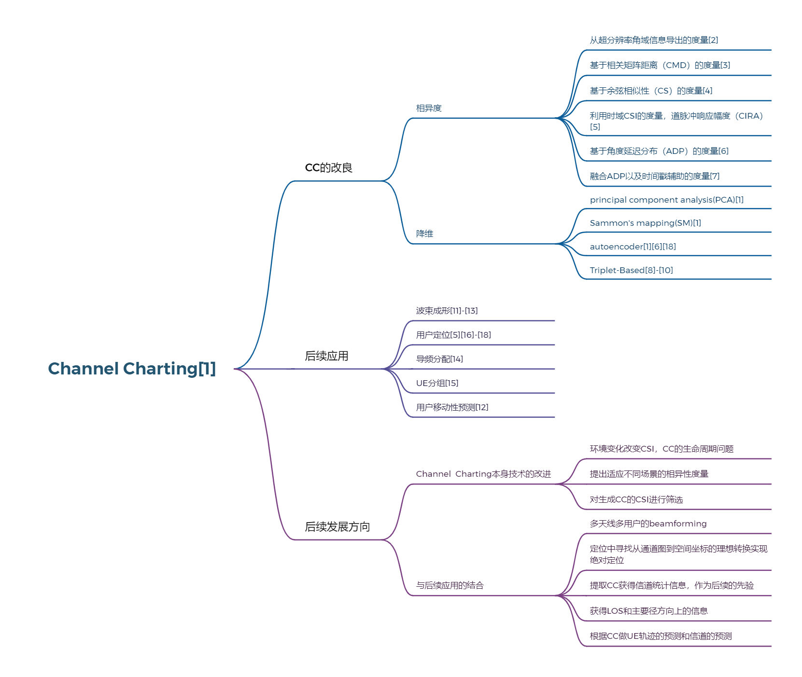

[1] Studer, Christoph, et al. “Channel Charting: Locating Users within the Radio Environment Using Channel State Information.” arXiv: Information Theory,arXiv: Information Theory, July 2018.

[2] Deng, Junquan, et al. “Multipoint Channel Charting for Wireless Networks.” 2018 52nd Asilomar Conference on Signals, Systems, and Computers, 2018.

[3] Agostini, Patrick, et al. “Channel Charting: An Euclidean Distance Matrix Completion Perspective.” ICASSP 2020 - 2020 IEEE International Conference on Acoustics, Speech and Signal Processing (ICASSP), 2020.

[4] Le Magoarou, Luc. “Efficient Channel Charting via Phase-Insensitive Distance Computation.” IEEE Wireless Communications Letters, Dec. 2021.

[5] Stahlke, Maximilian, et al. Indoor Localization with Robust Global Channel Charting: A Time-Distance-Based Approach. Oct. 2022.

[6] H. AL–Tous, P. Kazemi, C. Studer and O. Tirkkonen, "Channel Charting with Angle-Delay-Power-Profile Features and Earth-Mover Distance," 2022 56th Asilomar Conference on Signals, Systems, and Computers, Pacific Grove, CA, USA, 2022, pp. 1195-1201, doi: 10.1109/IEEECONF56349.2022.10052099.

[7] Angle-Delay Profile-Based and Timestamp-Aided Dissimilarity Metrics for Channel Charting. Aug. 2023.

[8] Ferrand, Paul, et al. “Triplet-Based Wireless Channel Charting: Architecture and Experiments.” IEEE Journal on Selected Areas in Communications, Aug. 2021, pp. 2361–73.

[9] Ferrand, Paul, et al. “Triplet-Based Wireless Channel Charting.” arXiv: Signal Processing,arXiv: Signal Processing, May 2020.

[10] Euchner, Florian, et al. Improving Triplet-Based Channel Charting on Distributed Massive MIMO Measurements. June 2022.

[11] Kazemi, Parham, et al. “Channel Charting Based Beam SNR Prediction.” 2021 Joint European Conference on Networks and Communications &amp; 6G Summit (EuCNC/6G Summit), 2021.

[12] Ponnada, Tushara, et al. “Location-Free Beam Prediction in mmWave Systems.” 2021 IEEE 93rd Vehicular Technology Conference (VTC2021-Spring), 2021.

[13] b-com, LucLeMagoarou(IRT, et al. Channel Charting Based Beamforming. Dec. 2022.

[14] Ribeiro, Lucas, et al. “Channel Charting for Pilot Reuse in mMTC with Spatially Correlated MIMO Channels.” 2020 IEEE Globecom Workshops.

[15] Al-Tous, Hanan, et al. “Adaptive Sector Splitting Based on Channel Charting in Massive MIMO Cellular Systems.” 2021 IEEE 93rd Vehicular Technology Conference (VTC2021-Spring), 2021.

[16] Zhang, Qianqian, and Walid Saad. “Semi-Supervised Learning for Channel Charting-Aided IoT Localization in Millimeter Wave Networks.” Cornell University - arXiv,Cornell University - arXiv, Aug. 2021.

[17] Karmanov, Ilia, et al. “WiCluster: Passive Indoor 2D/3D Positioning Using WiFi without Precise Labels.” Cornell University - arXiv,Cornell University - arXiv, May 2021.

[18] Agostini, Patrick, et al. “Not-Too-Deep Channel Charting (N2D-CC).” 2022 IEEE Wireless Communications and Networking Conference (WCNC), 2022.