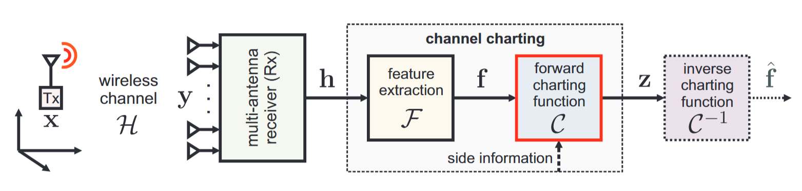
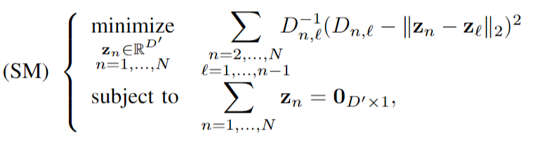
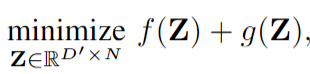
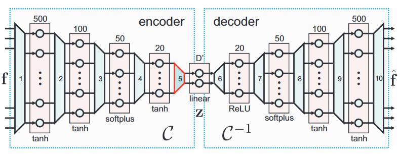
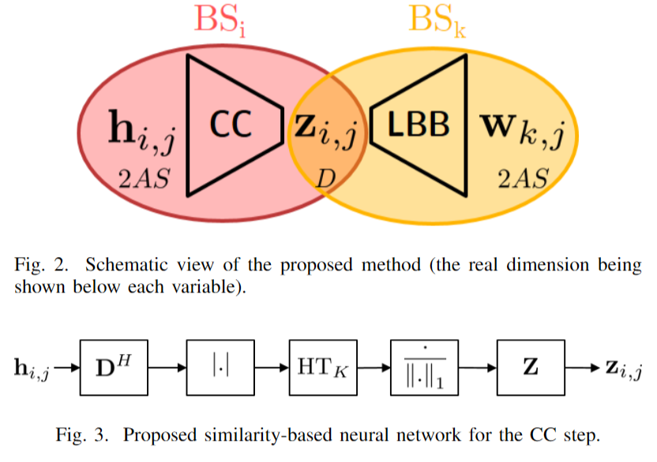
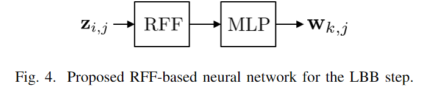

# Channel Charting

**1. 方向首先尝试ULA下的Channel Charting加波束成形的端到端模型建模**
   
   a.如何设计损失函数？

   b.模型在哪里训练？在一个BS中训练还是分布式训练(结合联邦学习？)

**2. 如何将CC从ULA单天线推广到MU与联合BF结合$\rightarrow$利用CC去决定哪些UE或者哪些BS配对。**

**3. 若CC推理的信道质量很差，可以将CC作为CSI估计的补充以提高CSI估计的复杂度与精确度。**

## Channel Charting: Locating Users within the Radio Environment using Channel State Information

我们提出了一种新的框架，我们称之为信道图，该框架将从小区中的UE获取的CSI映射到低维映射中，该低维映射捕捉真实UE在空间中位置的局部几何结构。信道制图是无监督的，即不需要来自真实UE位置的任何信息，例如，从全球导航卫星系统（GNSS）获得的信息。

 **建模流程**

 

 ### 1.提取特征$\mathcal{F}$

 使用欧氏距离作为CSI point之间相异度的度量$d_f(F,F^{'}) = || F - F^{'} ||_F$

 使用原始二阶矩R2M来计算CSI: $\overline{H} = \displaystyle \frac{1}{T}\sum^T_{t=1}h_t h^H_t$

 **A.特征缩放**

用$\tilde{H}$来替代$\overline{H}$以解决由于路径损耗问题导致的CSI不能很好表征空间几何关系的问题。

$$
    \tilde{H} = \displaystyle \frac{B^{\beta - 1}}{||\overline{H}||^{\beta}_F} \overline{H} \ \ with \ \ \beta = 1 + \frac{1}{(2\sigma)}
$$

**B.特征变换**

最直接的令$F = \tilde{H} \  \ denote \ as \ \mathbb{C\{\cdot\}}$

其他变换：实部$\mathfrak{R}\{\cdot\}$、虚部$\mathfrak{I}\{\cdot\}$、角度域$\angle\{\cdot\}$、绝对值$|\cdot|$。

其中角域中 R2M 的绝对值被证明是所有考虑通道模型和场景的最稳健的通道特征。

### 2.Channel Charting算法

 **A.PCA主成分分析**

 $Z_{PCA} = [\sqrt{\sigma_1}u_1,.....,\sqrt{\sigma_{D^{'}}}u_{D^{'}}]^H$

  **B.Sammon's Mapping**

Sammon的映射(SM)是一种经典的非线性方法，它将高维点集映射到较低维度的点集，目的是在两个点集之间保持小的成对距离

上式非凸，所以分解为两个凸函数迭代优化问题：

并且使用PCA初始化Z能取得更好的效果。

**C.自动编码Autoencoder**

学习一个编码器$\mathcal{C}:\mathbb{R}^{M^{'}} \rightarrow \mathbb{R}^{D^{'}}$和一个解码器$\mathcal{C}^{-1}:\mathbb{R}^{D^{'}} \rightarrow \mathbb{R}^{M^{'}}$

示例网络架构：

误差定义：

$$
    E = \displaystyle \frac{1}{2N}\sum^N_{n=1}||f_n - \mathcal{C}^{-1}(\mathcal{C}(f_n))||^2_2 + \frac{\beta}{2} ||W^{(5)}_{enc}||^2_F
$$

## Channel charting based beamforming

在本文中，将通道绘制作为基于位置的波束形成的输入。这允许基站根据图表位置而不是空间位置选择合适的预编码器。这减轻了对用户位置进行精确估计的需求，并为空间和频率[20]中的通道映射等几个应用程序开辟了道路。

> 先做CC和LBF的端到端，看看能不能构建新的loss function，看看能不能提升系统鲁棒性，然后扩展到多用户，就涉及到用户分组，基于稀疏性的分组，看看能不能用CC做分组，或者去解决他的真实方向偏转角和网格采样点不匹配的问题，因为CC中有保有用户的伪位置，是否可以根据这个去推断改进AoD

> 做到物理层，时间就更细，CC能不能提供到这么细粒度的信息。建立信道图谱，稀疏性的特性建立进去，贝叶斯的概率信息能不能也建立进去。

## Estimation of User Coordinates via Channel Charting and MUSIC

本文主要介绍了一种新的无线通信用户坐标估计方法，通过使用逆根平方通道系数（ISQ）算法，线性回归（LR）算法和MUSIC算法来估计到达角θ和基站与用户设备之间的距离ρ，以此生成极坐标下的信道图。该方法与PCA、Samson’s方法（SM）和自编码器（AE）等其他信道绘图算法进行了比较，发现ISQ、LR和MUSIC的性能优于前三种算法。本文还介绍了一些相关的概念，如信道模型、到达角和信道图的连续性和可信度等。

**A.使用MUSIC算法估计ρ、θ**

将R(CSI的自相关矩阵)分解为其特征向量并检查相应的特征值，我们可以将特征向量分成信号子空间 S 和噪声子空间 N ，使用噪声特征向量与信号空间特征值相比将对应于非常小的特征值这一事实（随机噪声的特征向量通常是随机的，因此它们在空间中的方向是不确定的，且分布较为分散，所对应的特征值也相对较小。）子空间S和N彼此正交。假设N的维数为p。通过将N的特征向量彼此相邻来形成N×p矩阵N。噪声子空间特征向量矩阵N和引导向量的乘积将几乎为零。我们可以使用这个概念通过在转向矢量中扫掠θ来找到正确的角度。

**B.IQS估计ρ**

$$
    \rho = \displaystyle \frac{1}{\sqrt{\sum^{N-1}_{n=1} abs(h_n)}}
$$

**C.LR估计ρ**

通过假设知道 256个（2048 个）UE 的位置并使用所有天线的 CSI 幅度之和的对数进行线性回归以找到 a 和 b

$$
    \rho = aX + b , \ \ \ where\ \  X = log\sum^{N-1}_{n=0} abs(h_n)
$$

## Improving Triplet-Based Channel Charting on Distributed Massive MIMO Measurements

本文主要介绍了基于三元组的通道绘图方法，该方法通过从大量的信道状态信息（CSI）中学习一个从高维空间到低维空间（也称为通道图）的映射，从而学习无需真实位置标签即可实现的自我监督训练方法。

**基于三元组的DNN训练**

训练使用三个在物理空间测量的CSI向量$(x_{anchor},x_{pos},x_{neg})$他们满足：
$$
    ||x_{anchor} - x_{pos}|| \leq ||x_{anchor} - x_{neg}||
$$

Triplet Seletion：为了生成一组（案例中为120万）三元组来训练DNN，从数据集中为每个三元组抽取一个锚点数据点（Sanchor、xanchor、tanchor）。然后，从|tn−tanchor|≤Tc的数据点集合（Sn，xn，tn）中随机选择一个数据点（Spos，xpos，tpos），其中Tc是正样本的阈值间隔。除非另有规定，否则我们将假设Tc=1.5s。接下来，从整个数据集中随机抽取阴性样本（Sneg，xneg，tneg）。
