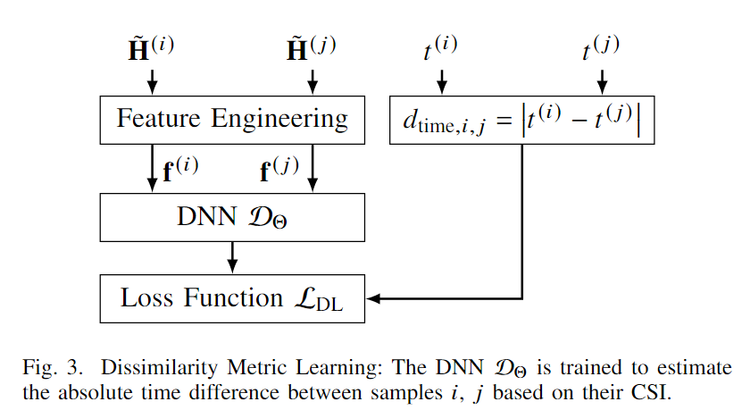

# Channel Charting

**1. 方向首先尝试ULA下的Channel Charting加波束成形的端到端模型建模**
   
   a.如何设计损失函数？

   b.模型在哪里训练？在一个BS中训练还是分布式训练(结合联邦学习？)

**2. 如何将CC从ULA单天线推广到MU与联合BF结合$\rightarrow$利用CC去决定哪些UE或者哪些BS配对。**

**3. 若CC推理的信道质量很差，可以将CC作为CSI估计的补充以提高CSI估计的复杂度与精确度。**

---

## Channel Charting: Locating Users within the Radio Environment using Channel State Information

我们提出了一种新的框架，我们称之为信道图，该框架将从小区中的UE获取的CSI映射到低维映射中，该低维映射捕捉真实UE在空间中位置的局部几何结构。信道制图是无监督的，即不需要来自真实UE位置的任何信息，例如，从全球导航卫星系统（GNSS）获得的信息。

 **建模流程**

 

 ### 1.提取特征$\mathcal{F}$

 使用欧氏距离作为CSI point之间相异度的度量$d_f(F,F^{'}) = || F - F^{'} ||_F$

 使用原始二阶矩R2M来计算CSI: $\overline{H} = \displaystyle \frac{1}{T}\sum^T_{t=1}h_t h^H_t$

 **A.特征缩放**

用$\tilde{H}$来替代$\overline{H}$以解决由于路径损耗问题导致的CSI不能很好表征空间几何关系的问题。

$$
    \tilde{H} = \displaystyle \frac{B^{\beta - 1}}{||\overline{H}||^{\beta}_F} \overline{H} \ \ with \ \ \beta = 1 + \frac{1}{(2\sigma)}
$$

**B.特征变换**

最直接的令$F = \tilde{H} \  \ denote \ as \ \mathbb{C\{\cdot\}}$

其他变换：实部$\mathfrak{R}\{\cdot\}$、虚部$\mathfrak{I}\{\cdot\}$、角度域$\angle\{\cdot\}$、绝对值$|\cdot|$。

其中角域中 R2M 的绝对值被证明是所有考虑通道模型和场景的最稳健的通道特征。

### 2.Channel Charting算法

 **A.PCA主成分分析**

 $Z_{PCA} = [\sqrt{\sigma_1}u_1,.....,\sqrt{\sigma_{D^{'}}}u_{D^{'}}]^H$

  **B.Sammon's Mapping**

Sammon的映射(SM)是一种经典的非线性方法，它将高维点集映射到较低维度的点集，目的是在两个点集之间保持小的成对距离

上式非凸，所以分解为两个凸函数迭代优化问题：

并且使用PCA初始化Z能取得更好的效果。

**C.自动编码Autoencoder**

学习一个编码器$\mathcal{C}:\mathbb{R}^{M^{'}} \rightarrow \mathbb{R}^{D^{'}}$和一个解码器$\mathcal{C}^{-1}:\mathbb{R}^{D^{'}} \rightarrow \mathbb{R}^{M^{'}}$

示例网络架构：

误差定义：

$$
    E = \displaystyle \frac{1}{2N}\sum^N_{n=1}||f_n - \mathcal{C}^{-1}(\mathcal{C}(f_n))||^2_2 + \frac{\beta}{2} ||W^{(5)}_{enc}||^2_F
$$

---

## Channel charting based beamforming

在本文中，将通道绘制作为基于位置的波束形成的输入。这允许基站根据图表位置而不是空间位置选择合适的预编码器。这减轻了对用户位置进行精确估计的需求，并为空间和频率[20]中的通道映射等几个应用程序开辟了道路。

> 9月19号组会：先做CC和LBF的端到端，看看能不能构建新的loss function，看看能不能提升系统鲁棒性，然后扩展到多用户，就涉及到用户分组，基于稀疏性的分组，看看能不能用CC做分组，或者去解决他的真实方向偏转角和网格采样点不匹配的问题，因为CC中有保有用户的伪位置，是否可以根据这个去推断改进AoD
> 做到物理层，时间就更细，CC能不能提供到这么细粒度的信息。建立信道图谱，稀疏性的特性建立进去，贝叶斯的概率信息能不能也建立进去。

---

## Estimation of User Coordinates via Channel Charting and MUSIC

本文主要介绍了一种新的无线通信用户坐标估计方法，通过使用逆根平方通道系数（ISQ）算法，线性回归（LR）算法和MUSIC算法来估计到达角θ和基站与用户设备之间的距离ρ，以此生成极坐标下的信道图。该方法与PCA、Samson’s方法（SM）和自编码器（AE）等其他信道绘图算法进行了比较，发现ISQ、LR和MUSIC的性能优于前三种算法。本文还介绍了一些相关的概念，如信道模型、到达角和信道图的连续性和可信度等。

**A.使用MUSIC算法估计ρ、θ**

将R(CSI的自相关矩阵)分解为其特征向量并检查相应的特征值，我们可以将特征向量分成信号子空间 S 和噪声子空间 N ，使用噪声特征向量与信号空间特征值相比将对应于非常小的特征值这一事实（随机噪声的特征向量通常是随机的，因此它们在空间中的方向是不确定的，且分布较为分散，所对应的特征值也相对较小。）子空间S和N彼此正交。假设N的维数为p。通过将N的特征向量彼此相邻来形成N×p矩阵N。噪声子空间特征向量矩阵N和引导向量的乘积将几乎为零。我们可以使用这个概念通过在转向矢量中扫掠θ来找到正确的角度。

**B.IQS估计ρ**

$$
    \rho = \displaystyle \frac{1}{\sqrt{\sum^{N-1}_{n=1} abs(h_n)}}
$$

**C.LR估计ρ**

通过假设知道 256个（2048 个）UE 的位置并使用所有天线的 CSI 幅度之和的对数进行线性回归以找到 a 和 b

$$
    \rho = aX + b , \ \ \ where\ \  X = log\sum^{N-1}_{n=0} abs(h_n)
$$

---

## Triplet-Based Wireless Channel Charting: Architecture and Experiments

这篇文章的主要贡献在于描述了一种基于三元组的通道图绘制方法，该方法可用于随时间连续收集的训练数据集。我们使用这些时间信息来教导网络区分近的CSI点和远的点，并使用学习到的距离来产生低维潜在空间中的点的表示。解决了在信道数据降维过程中距离度量不可靠的问题。

>三元组为样本空间中的三个点$(x_i,x_j,x_k)$他们是$(t_i,t_j,t_k)$时刻的采样点，满足$|t_j - t_i| \leq T \leq |t_k - t_i|$。
>$d_{CSI}$代表CSI降维后通道图点的距离，即$d_{CSI}(x,x^{'}) = ||f_{\theta}(x) - f_{\theta}(x^{'})||$

本文具体模型架构如下所示：

其中$d_{CSI}(s_i,s_j)$代表近样本的距离，$d_{CSI}(x_i,x_j)$代表远样本的距离

代价函数$C_t = \displaystyle \sum_{(i,j,k) \in \tau_T} (d_{CSI}(x_i - x_j) - d_{CSI}(x_i,x_k) + M)^{+}$

### 未来工作

当我们增加潜在空间的维度时，也会变得更难区分不同的方法。现实应用程序提供的洞察力可以引导我们朝着正确的方向构建更精确的指标。

---

## Improving Triplet-Based Channel Charting on Distributed Massive MIMO Measurements

本文主要介绍了基于三元组的通道绘图方法，该方法通过从大量的信道状态信息（CSI）中学习一个从高维空间到低维空间（也称为通道图）的映射，从而学习无需真实位置标签即可实现的自我监督训练方法。

注意文章提到了三元组的选择与实际目标函数或用于学习嵌入的方法一样重要，但并未提及三元组原则方法的对比。

在实际的蜂窝系统中，许多硬件和协议设计特性可能会破坏BS所看到的无线信道状态。本文提到了几种预处理方法来减轻这些影响。

**基于三元组的DNN训练**

训练使用三个在物理空间测量的CSI向量$(x_{anchor},x_{pos},x_{neg})$他们满足：
$$
    ||x_{anchor} - x_{pos}|| \leq ||x_{anchor} - x_{neg}||
$$

Triplet Seletion：为了生成一组（案例中为120万）三元组来训练DNN，从数据集中为每个三元组抽取一个锚点数据点（Sanchor、xanchor、tanchor）。然后，从|tn−tanchor|≤Tc的数据点集合（Sn，xn，tn）中随机选择一个数据点（Spos，xpos，tpos），其中Tc是正样本的阈值间隔。除非另有规定，否则我们将假设Tc=1.5s。接下来，从整个数据集中随机抽取阴性样本（Sneg，xneg，tneg）。

---

## Efficient channel charting via phase-insensitive distance computation

本文提出了一种计算高效的信道绘制方法，该方法基于距离测量的计算，该距离测量被设计为对小规模衰落不敏感，并局部反映物理距离。这一措施在理论上是基于一个简单的物理信道模型。它允许从训练通道计算距离矩阵，然后在Isomap非线性降维方法中使用该矩阵来获得图表坐标。

通道之间的欧几里得距离对小尺度衰落非常敏感，这显然是对通道绘制任务的有害行为。这种敏感性来自于由于用户移动小而导致的通道全局阶段的变化非常快。为了克服这个问题，所以提出了一种对通道全局相位完全不敏感的距离度量：

$$
    d^{*}(h_K,h_l)^2 \triangleq \underset{\phi \in [0,2\pi]}{min}|| \displaystyle \frac{h_k}{||h_k||_2} - e^{j\phi}\frac{h_l}{||h_l||_2} ||^2_2
$$

使用这种相位不敏感的距离d允许获得对小尺度衰落的不敏感性，而不引入维度M2的特征，也不必失去对绝对方向和延迟的所有灵敏度。

使用Isomap来进行降维操作。它是基于这样一种假设，即可以可靠地计算训练样本之间的小距离，但不能计算大距离。它基于邻域图（考虑k个邻域），通过寻找最短路径来估计大距离。这允许仅使用较小的d值来近似大距离。然后，将多维缩放（MDS）应用于所获得的距离矩阵，以获得低维嵌入。

---

## Indoor Localization with Robust Global Channel Charting: A Time-Distance-Based Approach

提出了一种基于全局通道绘图的室内定位方法，该方法使用时间同步的单输入/单输出信道状态信息（CSI），并提出了一种新的距离度量方法，使得该方法能够学习环境的全局几何结构而无需注释。同时，该方法工作建立在Isomap的思想之上,使用Siamese神经网络来优化全局通道图，并使用线性变换将其映射到实际世界坐标系，从而实现了全局通道图辅助指纹定位和定位预测。

>**注**:Isomap（Isometric Mapping的缩写）是一种非线性降维算法，用于将高维数据映射到低维空间，同时保持数据点之间的测地距离关系。它是一种流行的降维技术，旨在捕获数据的非线性结构和流形特征。Isomap算法的主要思想是构建数据点之间的测地距离矩阵，然后使用多维缩放（MDS）技术将这些距离映射到低维空间。具体步骤如下：
构建距离图：首先，计算每对数据点之间的欧氏距离或其他适当的距离度量，并构建一个距离图，表示数据点之间的距离关系。
寻找最近邻：对于每个数据点，找到其在高维空间中最近的K个邻居（K是用户定义的参数）。这些最近邻点将在构建测地距离图时起到关键作用。
构建测地距离图：使用最近邻信息，构建一个测地距离图，其中每个数据点表示为图中的节点，距离表示为边的权重。通常，这个图是一个加权的k-最近邻图，其中边的权重是两个节点之间的欧氏距离。
计算测地距离：使用图论算法（例如Dijkstra算法）计算每对节点之间的测地距离，这些测地距离考虑了图中的路径，而不仅仅是直线距离。
多维缩放（MDS）：将测地距离矩阵作为输入，应用多维缩放算法将数据映射到低维空间，以便在低维空间中尽量保持数据点之间的测地距离关系。
选择低维表示：根据需要选择目标低维空间的维度，通常为2维或3维，以便可视化或进一步分析数据。
>

### 近似局部CSI距离：

本文通过时间对齐的CIR的差和来近似局部CSI距离：

$$
    d^{'}_s (\tilde{h}_i,\tilde{h}_j) \triangleq \displaystyle \sum^{N_b - 1}_{k=0}\sum^{T-1}_{t=0} | \ |\tilde{h}^{(k)}_i (t)| - |\tilde{h}^{(k)}_i (t)| \ |
$$

### 引入全局距离

通过Isomap的思想，将全局距离创建为流形上最短路径上的局部距离之和，即测地距离。(流形是指一个具有曲率的空间，而最短路径的局部距离之和是指在这个空间中，通过连接相邻数据点的最短路径来计算它们之间的距离，并将这些距离加起来得到全局距离。)

pair-wise distances:

得到$D_{pw}$以创建邻域图。然后，使用最短路径估计器（例如通过Dijkstra算法）来估计通道图的每个坐标之间的最短路径$d^{'}_{geo}(\tilde{h}_i,\tilde{h}_j) \triangleq \sum_{p \in \mathcal{P}} d^{'}_s (\tilde{h}_p,\tilde{h}_{p+1})$

随后Siamese网络取代了MDS方法进行降维，将高维的CSI距离映射到低维流形中，损失函数定义为：

$$
    \mathcal{L} = |\ d^{'}_{geo}(\tilde{h}_i,\tilde{h}_j) - ||z_i - z_j||_2 \ |
$$

当神经网络使用CSI测量作为输入数据时，该网络学习从输入数据的流形到2D嵌入的变换。这允许网络进行插值，因此也可以有效地处理看不见的数据，而无需重新计算测地线距离矩阵。

随后使用所有点来估计具有最小二乘解的变换矩阵：$\hat{\mathcal{A}} \triangleq argmin_{\mathcal{A}}||\mathcal{A}z - x ||^2_2$

### 未来工作

**样本的选择问题**：

记录数据的最必要信息的选择是重要的，但这是一个不平凡的问题，因为样本的随机选择可能导致环境的高密度区域处的冗余CSI，并因此导致低密度区域的表示不足。由于数据的收集是无监督的，因此不可能进行数据的空间选择，这使得样本选择具有挑战性。

**局部通道图转化全局坐标系**：

几种半监督方法可以解决这个问题，通过向非线性CC优化添加约束，将局部图表转换为现实世界框架，相反，通过在CC目标中添加约束，通常需要更大量的数据，因为算法试图学习非线性、高度灵活的变换，因此倾向于过度拟合数据

**环境的变化**：

 CC 的一致性主要取决于在特定场景中收集的数据。环境变化可能会改变特定于环境的CSI，从而导致预测中的错误。这也可能需要通道图，渲染 CC 生命周期管理。

---

## Angle-Delay Profile-Based and Timestamp-Aided Dissimilarity Metrics for Channel Charting

提出了一种考虑角度域信息的新的相异性度量以及一种新的基于深度学习的度量。此外，我们提出了一种融合相异性度量的方法，以便在学习通道图时可以考虑测量通道的时间以及通道状态信息的相似性。

本文对相异性度量的划分：

通过利用时域CSI的稀疏性，提出了基于CS的度量的增强版本。时域中的大多数信号功率集中在LoS路径（如果存在）和少数强多径分量（MPC）中。我们建议对抽头的时域CSI矩阵进行求和𝜏 = 𝜏分钟，𝜏max，其中𝜏最小值和𝜏max必须适应无线电环境，使得所有相关MPC都被考虑在内，其可以解释为使用在多个时域抽头和MPC上测量的功率方面的角域相似性：

本文不仅使用神经网络进行流形学习，还使用它们来学习相异性度量本身。

### 未来工作

尝试找到从通道图到空间坐标的理想转换，实现绝对定位，是未来研究的一个潜在课题。这项工作强调了相异性度量的重要性，表明相异性的质量与应用的流形学习技术一样重要。

