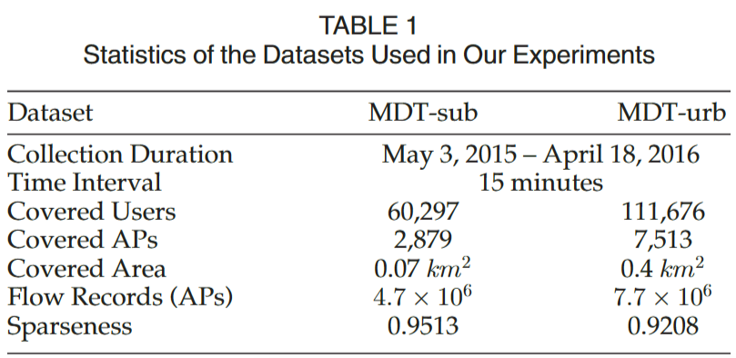
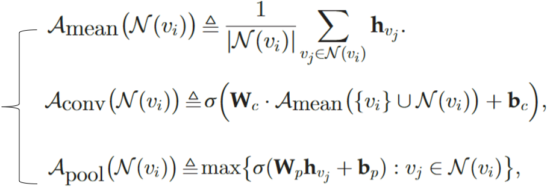
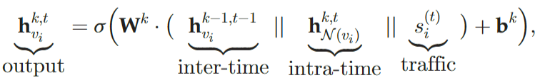
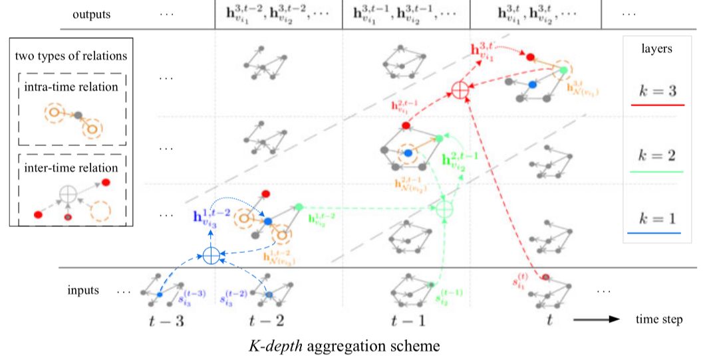
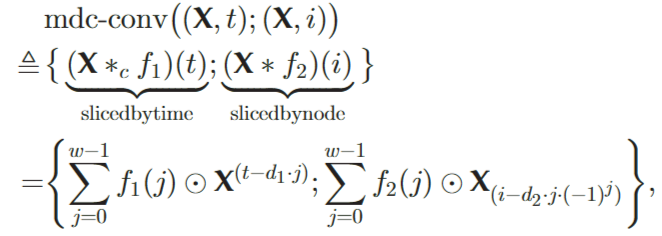
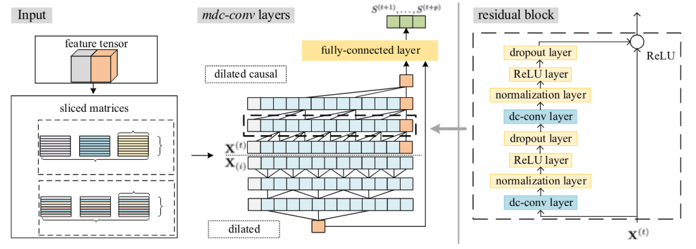
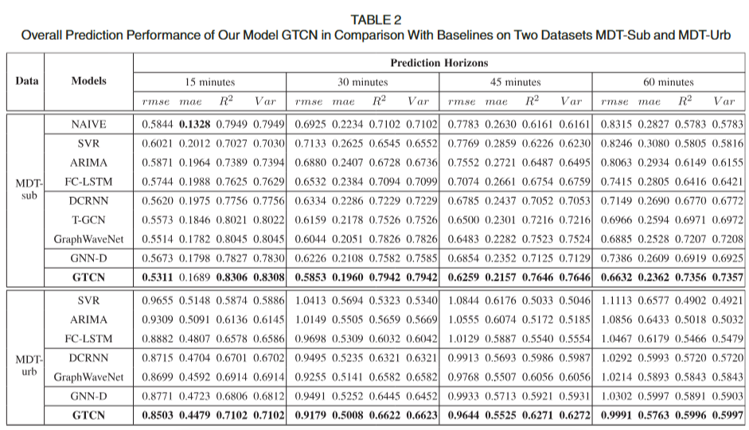
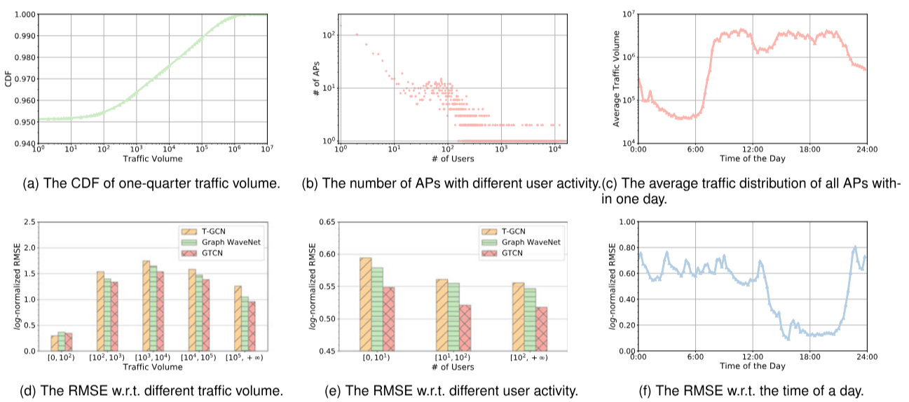

# Mobile Data Traffic Prediction by Exploiting Time-Evolving User Mobility Patterns
***——利用时间演化用户移动性模式进行移动数据流量预测***

---------

## 摘要翻译

了解移动数据流量和预测未来的流量趋势有利于需要执行资源分配和节能管理的无线运营商和服务提供商。然而，由于以下两个因素，在大规模细粒度准确预测无线流量尤其具有挑战性:**用户任意运动引入的网络单元(即单元塔或接入点)之间的空间相关性，以及频繁随时间变化的用户运动的时间演化性质**。在本文中，我们使用时间演化图来制定用户运动的时间演化性质，并提出了一个基于模型的时间卷积网络(GTCN)来预测无线网络中每个网络单元的未来流量。GTCN 可以为两个方面带来显着的好处。(1) GTCN可以通过节点聚合方法有效地学习时间演化图中网络单元之间的内部和时间间空间相关性。(2) GTCN可以通过时间卷积层有效地对不同网络单元移动流量趋势的时间动态进行建模。两个真实世界数据集的实验结果证明了我们方法的有效性和有效性。与最先进的方法相比，我们的 GTCN 的预测性能在不同预测范围内提高了 3.2 到 10.2%。GTCN在预测时间上也快8.4倍。

## 一、 论文试图解决什么问题？

1. 移动用户的移动性模式没有被利用。现有的工作侧重于利用显式空间关系，例如网络单元之间的距离，而忽略了用户时空移动模式引入的隐式关系。
2. 从前的工作没有考虑网络单元的可变性，以前的方法无法从更改的网络中学习新的特征，除非每次网络拓扑发生变化时，它们都会在整个网络中训练模型。

提出的三个挑战：

> **a.考虑到用户随时间的演变，如何对用户移动性进行建模？** 将用户轨迹表示为序列的传统方法缺乏对空间信息建模的表达式。所提出的公式应该明确表示用户移动性如何随时间变化。
>
> **b.如何联合利用用户移动性模式和历史时间流量趋势来预测未来的交通量?** 空间信息和时间流量是异构的。空间信息通常表示为网格图或图，而时间流量自然表示为时间序列。所需的方法应该将它们集成到一个模型中。
>
>  **如何从各种网络单元捕获流量序列的较长时间动态?** 较大的输入会线性增加计算负担。

## 二、本文的主要贡献

出了一种基于图的时间卷积网络(GTCN)来解决上述问题，为了解决问题a，我们将用户移动性制定为演化图，并提出了一种节点聚合方案，该方案利用用户移动轨迹随时间动态更新节点嵌入。

解决b，在第一个聚合步骤中将节点的历史流量负载视为其在时间演化图中的嵌入。然后，节点聚合方案通过聚合节点之间的时间内关系和时间间关系来调整每个节点的嵌入。

解决c，修改时间卷积层并使用两种类型的卷积操作来区分每个节点的单个流量趋势和所有节点的公共流量趋势。

## 三、数据集描述

从2015年5月3日到2016年4月18日，定期（每15分钟）对中国郊区或城市两个校区的所有无线接入点（AP）进行调查，并通过SNMP（简单网络管理协议），收集其连接的移动设备的信息（如MAC地址、每个MAC地址的流量）。然后，可以从这两个园区分别生成两个移动数据流量数据集，分别表示为MDT-sub和MDT-urb。基于这个数据集，知道两种信息：1）移动设备是否在一个时间间隔内连接到AP；2） 一个移动设备在一个时间间隔内产生了多少流量。WiFi网络中的每个AP覆盖大约100平方米的面积。时间间隔可以设置为大约15秒。对于覆盖1平方公里的蜂窝基站，我们可以将时间间隔设置为大约25分钟。使用$log_{10}$函数将流量Y缩放到小规模：$Y_{norm} = log_{10}Y$

检测器输出用户的移动矩阵和 AP 的历史流量预测模型的输入。

## 四、模型介绍

> **符号定义：** 
> $V = \{v_1,v_2,……,v_N\}$：表示网络单元(如AP)。
> $A^{(t)} \in \{0,1\}^{N\times N}$：描述节点连接的邻接矩阵。$a^{(t)}_i$代表t时刻$v_i$节点的流量向量。
> $S^{(t)}_i = [a^{(t-r+1)}_i,a^{(t-r+2)}_i,……,a^{(t)}_i]^T \in R^r$: 过去时间步长r中节点$v_i$的历史流量的r维向量。且 $S^{(t)} = [S^{(t)}_1,……,S^{(t)}_N] \in R^{r \times N}$
> $G^{(t)} = (A^{(t)},S^{(t)})$在时间步长t观察到的图快照
> $N(v_i)$ ： $G_t$中节点$v_i$的内邻居集
> $S^{(t)}_L \in R^{1 \times N}$ : 代表 $S^{(t)}$的最后一行。

> 输入：$\{G^{(1)},……,G^{(t)}\}$
> 输出：$\{S^{(t+1)}_L,……,S^{(t+p)}_L\}$

### 1. 节点嵌入

**1. 建模空间关系**

使用$H_{v_i} \in R^r$表示流量信息，则相邻节点的流量信息可由下式聚合：
$$
    \begin{equation}
        h_{N(v_i)} = A(\{v_j ： v_j \in N(v_i)\})
    \end{equation}
$$

其中聚合函数有平均函数、普卷积函数、池化函数：

本文使用了普卷积函数以及池化函数进行计算，并将它们连接在一起形成$h_{N(v_i)} \in R^{2r_a}$

**2. 建模时间关系**

提出方案：从  使用K层来聚合$\{G_{t-K+1},……,G_t\}$的前K个时间步长的流量。将节点$v_i$在t时刻，第k层的聚合嵌入向量表示为$h^{k,t}_{v_i} \in R^{r_k}$聚合方法如下所示：

聚合层之后将$h^{k,t}_{v_i}$ 进行$L_2$归一化：$h^{k,t}_{v_i} <—— h^{k,t}_{v_i} / ||h^{k,t}_{v_i}||_2$，节点$v_i$在时间步长t的最终嵌入表示为$h^{K,t}_{v_i}$，所有节点的集合为$h^{k,t}_{V} \in R^{r \times N}$

上述时空建模流程的流程图：

### 2. 长期时间模式建模

**多输入因果扩张卷积(dc-conv)：**

给定一个一维序列输入$x \in R^n$和一个滤波器$f:\{0,……,w-1\} ->R$，则x在f下的de-conv的第t个元素为(d为扩张因子，w为滤波器大小)：

$$
    \begin{equation}
        dc-conv(x,t) = (x *_c f)(t) = \sum^{w-1}_{j=0}f(j)·x^{t-d·j}
    \end{equation}
$$

为了利用各个节点流量的共同趋势例如早晚高峰，提出了**mdc-conv**。mdc-conv的输入为时间跨度为T的序列$X \in R^{2r \times N \times T}$。且$X$的时间切片$X^{(t)} = h^{k,t}_V || S^{(t)} \in R^{2r \times N}$，以节点i切分的$X$表示为$X_{(i)} \in R^{2r \times T}$

在时间t下表i处的mdc-conv如下所示($f_1、f_2$为两个长为w的滤波器)：

残差链接模块：使用$F$表示一层网络，它包括两组mdc-conv层，一个Norm层，一个ReLU激活层，一个dropout层，最后输出与输入链接：$ReLU(X+F(X))$

时间动态预测模块的流程图：

最终得到$Z_1 \in R^{2r \times N}$和$Z_2 \in R^{2r \times T}$。$Z_1$包含每个节点的个体趋势；$Z_2$包含不同节点的共同趋势。将两部分相乘$Z^{T}_{2}·Z_1$，最后连接一个全连接层去预测未来的流量信息$S^p=\{S^{(t+1)}_{r:},……,S^{(t+p)}_{r:}\}$

$$
    \begin{equation}
        \widehat{S^p} = FCN(Z_1 || (Z^{T}_{2}·Z_1))
    \end{equation}
$$

损失函数定义为$L = ||S^p - \widehat{S^p}||_2 + \lambda L_{reg}$

## 五、实验

不同因素对预测结果影响的研究：

this is a git test

this is a git test 2

this is a git test 3

