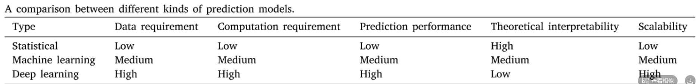
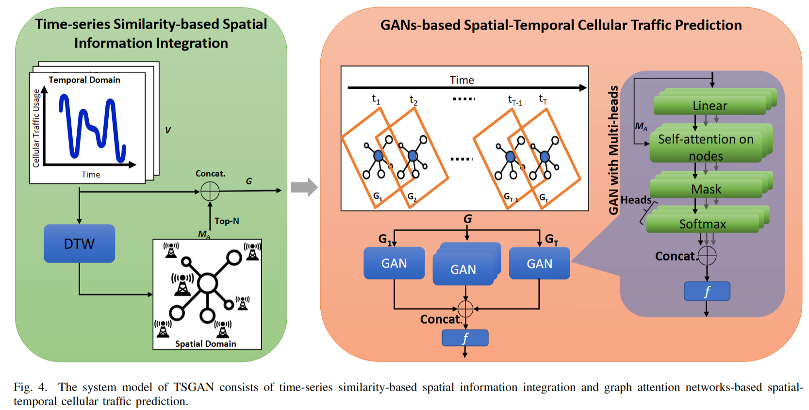
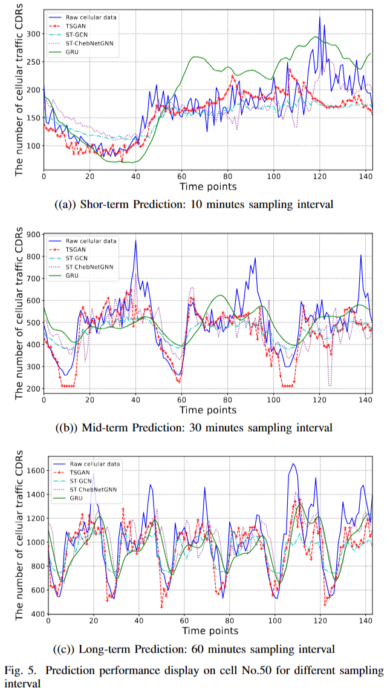
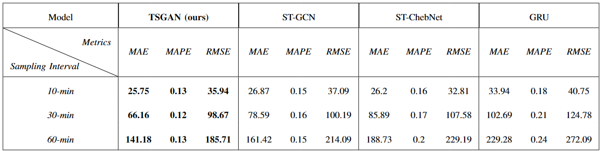

# 流量预测综述 Cellular traffic prediction with machine learning: A survey

**四种问题类型：** 单变量时间问题、单变量时空问题、多变量时间序列问题和多变量时空问题。

**四种工作流程：** 直接预测、分类然后预测、分解然后预测和聚类然后预测。

**三种模型：** 
统计模型：时间序列、概率估计和粒子滤波模型

机器学习模型：随机森林 (RF)、高斯进度回归 (GPR)、多元线性回归 (MLR) 等(大多是基于树的)

深度学习模型：前馈神经网络 (FFNN)、CNN 、循环神经网络 (RNN)、LSTM、GNN、GCN、GAT

**三种模型的比较：**

**用于流量预测的辅助技术：** 移动性预测、数据增强、迁移学习、元学习和联邦学习。

------------------------

# Spatial-Temporal Cellular Traffic Prediction for 5 G and Beyond A Graph Neural Networks-Based Approach

***——5G及以后的时空蜂窝流量预测：一种基于图神经网络的方法***

-----------------------

## 摘要翻译

在过去的十年中，工业4.0通过在制造过程中引入先进的通信和网络技术，极大地提高了工业生产率的提高。随着新的通信技术和网络设施不断涌现，特别是5G及以上蜂窝网络的快速发展，工业5.0蓝图提出了更智能、更可靠、更高效的蜂窝网络服务的需求。为了满足这些日益具有挑战性的要求，主动有效地分配蜂窝网络资源变得至关重要。蜂窝流量预测作为蜂窝网络资源管理系统的重要组成部分，对精度和可靠性的要求严格，面临着严峻的挑战。最关键的问题之一是通过联合探索蜂窝交通数据中的空间和时间信息来提高预测性能。图神经网络 (GNN) 为这个问题提供了一个有前途的解决方案，它可以联合利用时域中的蜂窝流量和空间域中蜂窝网络的物理或逻辑拓扑来进行准确的预测。在本文中，我们对现实世界的蜂窝网络流量数据集进行了时空分析，并回顾了该领域的最新研究。在此基础上，我们进一步提出了一种基于时间序列相似度的图注意网络TSGAN，用于时空蜂窝流量预测。仿真结果表明，在短期、中期和长期预测场景下，我们提出的TSGAN在真实世界蜂窝网络数据集上的性能优于三种基于gnn或GRU的经典预测模型。

## 一、相关研究

### 1. 基于无向图的时空蜂窝流量预测

1.1 GCLSTM

首先使用依赖图来对基站之间的空间相关性进行建模，从而在没有任何数据聚合的情况下保留了空间粒度。主要用每个门中的图卷积来代替LSTM中的矩阵乘法，这可以利用空间和时间信息，减少可训练参数的数量。

1.2 TGCN

时间图卷积网络（TGCN），一种图序列表示网络模型，将时间卷积网络和图卷积网络相结合，学习用于ITW预测的高级时空模式。

1.3 STACN

时空注意力卷积网络（STACN），使用Anseline局部Moran’s I统计测度，基于蜂窝流量时间序列之间的相关性来探索空间信息,可以自适应地聚合外部因素，并输出细胞流量的每小时、每天和每周的时间分量。

### 2. 基于有向图的时空蜂窝流量预测

2.1 STHGCN

时空混合图卷积网络（STHGCN）确定了三类空间依赖性：空间接近性、功能相似性和近期趋势相似性。使用ChebyNet获得空间依赖性，然后通过连接门控递归单元（GRU）连续获得时间依赖性。

2.2 STGCN-HO

基于转移概率矩阵给出的切换频率，建立了基站的有向加权切换图。包含切换信息的时空图卷积网络（STGCN-HO）模型使用了包含图卷积和门控线性单元的堆叠残差神经网络结构来捕获蜂窝业务的空间和时间信息。

## 二、 本文提出的模型：基于时间序列相似性的图注意力网络TSGAN

TSGAN由两个子模块组成，即基于时间序列相似性的空间信息集成和基于GANs的时空蜂窝流量预测。TSGAN首先从蜂窝流量使用的时间序列中提取目标蜂窝网络的空间拓扑，并将空间域中最相关的连接信息与时域中的时间序列蜂窝流量集成为图。然后，将具有空间信息集成的蜂窝流量使用数据视为包含蜂窝网络流量已完成时空信息的连续切片。接下来，蜂窝流量使用切片将成为图注意力网络的输入，用于时空蜂窝流量预测。

### 1. 提取蜂窝网络空间拓扑

采用**DTW**来计算每两个小区的网络流量之间的时间序列相似性，以呈现空间信息。两个小区的时间序列之间的DTW距离$DTW(i，j)$可以通过下式计算

$$
    \begin{equation}
        DTW(i,j) = D(i,j) + min\{DTW(i-1,j),DTW(i,j-1),DTW(i-1,j-1)\}
    \end{equation}
$$

$DTW(i，j)$即可作为网络邻接矩阵$M_A$的元素。

定义$G = {(V,M_A)}$为蜂窝业务使用切片的有向图集合，$V$为网络的所有时间序列蜂窝业务的集合，在$T$时间段内定义$G = \{G_1,G_2,……,G_T\}$，$G_T = \{(V_T,M_A)\}$

> **DTW(dynamic time warping):**_动态时间规整是一种衡量两个长度不同的时间序列A,B的相似度的方法。步骤为：1.计算两个序列之间的距离矩阵$M(i,j)=|A(i)-B(j)|$2.寻找一条从矩阵左上角到右下角的路径使得路径上的元素和最小。
>求出最短路径：假设矩阵为M，从矩阵左上角(1,1)到任意一点(i,j)的最短路径长度为$L_{min}(i,j)$，那么就可以使用递归算法求最短路径长度。
>起始条件：$L(1,1)=M(1,1)$
>递推规则：$L_{min}(i,j)=min\{L_{min}(i,j-1),L_{min}(i-1,j),L_{min}(i-1,j-1)\}$

### 2. 用于时空蜂窝流量预测的图注意力网络

考虑到目标小区与其在蜂窝网络中相邻的小区具有不同的相似性，TSGAN基于图注意力神经网络对流量数据进行时空预测。

>TSGAN的输入：G
>
>TSGAN的输出：$V_{T+\Delta t} = F_{TSGAN({V_T,M_A})}$

在TSGAN的每个图注意力神经网络中，图注意力层、注意力机制和注意力系数可以通过

$$
    \begin{equation}
        \begin{aligned}
            v_{i}^{'} &= f(\sum_j \alpha_{ij}W_{v_j}) \\
            \alpha_{ij} &= softmax_{j} (e_{ij}) = \displaystyle\frac{exp(e_{ij})}{\sum_k exp(e_{ik})} \\
            e_{ij} &= \alpha(W_{v_{i}^{'}} , W_{v^{'}_j}) = \alpha^T[W_{v_{i}^{'}} || W_{v_{j}^{'}}]M_A 
        \end{aligned}
    \end{equation} \\
$$

其中f函数为LeakyReLU激活函数。多头注意力图注意力网络的最终输出为(H为heads个数，||为级联运算)：

$$
    \begin{equation}
    v^{'}_{i} = ||^{H}_{h=1}f(\sum_{j}\alpha^{h}_{ij}W^{h}v_{j})
    \end{equation}
$$

Loss函数设计：

$$
    \begin{equation}
        Loss_{MSE} = \displaystyle \frac{1}{N}\frac{1}{W}\frac{1}{T}\sum^N_{i=1}\sum^W_{w=1}\sum^T_{t=1}(\hat{y}^{w,i}_t - y^{w,i}_t)^2
    \end{equation}
$$

## 三、评估实验设计

### 1. 训练细节

**1.1 数据集**

>米兰市真实采集的蜂窝流量数据集，数据包括8个特征(SquareID、Datetime、CountryCode、SmsIn、SmsOut、CallIn、CallOut、Internet)，62天内互联网活动的数百万条呼叫详细记录（CDR），采样间隔为10分钟，在空间分析方面，米兰市的地图被划分为100×100个区域，每个区域为0.05平方公里。通过计算处理>基站的覆盖面积，对城市中每个区域的CDR进行空间聚合。

实验选择米兰市中心的10*10小区范围，提取连续30天的蜂窝流量CDR作为时间序列进行评估。前24天的蜂窝业务数据用作训练集，其余6天用作测试集。时间窗口的长度设置为7个时间实例。

**1.2 训练参数**
TSGAN，通过对小区的前5个邻居进行滤波来生成邻接矩阵。TSGAN为输入层设置六个维度，隐藏层设置六种维度，输出层设置一种维度。多头注意力的数量设置为两个。在训练阶段，batch=32，并选择Adam作为优化器。

**1.3 baseline**

ST-GCN(基于GCN)、ST-ChebNetGNN(基于Chebnet)、GRU(基于传统深度网络)

**1.4评级指标**

均方根误差（RMSE）、平均绝对误差（MAE）和平均绝对百分比误差（MAPE）

### 2. 实验结果

比较了四种方法不同采样间隔的性能

