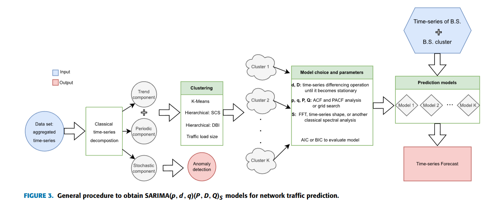

# traffic prediction

## 工作流程与模型分类

**四种工作流程：** 直接预测、分类然后预测、分解然后预测、聚类然后预测。

**三种模型分类:** 统计模型、机器学习模型、深度学习模型

## 统计模型

## 机器学习模型

***1.SARIMA模型***

**ARMA**自回归移动平均模型是平稳时间序列建模中常用方法：

$$
    \begin{equation}
        \begin{aligned}
            (AR):x_t = \sum^p_{i=1}\phi_{i}x_{t-i} + \varepsilon_{t} \\
            (MA):x_t = \mu + \sum^q_{i=1}\theta_{i}\varepsilon_{t-i} + \varepsilon_{t}
        \end{aligned}
    \end{equation}
$$

则自回归移动平均模型ARMA(p,q)表示为：

$$
    \begin{equation}
        x_t - \sum^p_{i=1}\phi_{i}x_{t-i} = \sum^q_{i=1}\theta_{i}\varepsilon_{t-i} + \varepsilon_{t}
    \end{equation}
$$

使用MLE来估计模型参数，$D$为观测集,假设$\varepsilon_t \sim N(0,\sigma^2)$

$$
    \begin{equation}
        \begin{aligned}
            p(D|\phi) \propto \prod^n_{t=1}p(x_t|\phi,x_{t-1}) \\
            p(x_t|\phi , x_{t-1}) = (\frac{1}{2\pi \sigma^2})^{\frac{1}{2}} \ exp(-(\frac{1}{2\sigma^2})(x_t - \Phi^T x)^2) \\
        \end{aligned}
    \end{equation}
$$

MLE具体来说是使得下式最小化,转化为了最小二乘问题。

$$
    NLL(\theta) = \frac{n}{2}ln(2\pi \sigma^2) + \frac{1}{2\pi \sigma^2}\sum^n_{i=1}(x_t - \Phi^T x)^2
$$

缺点：要求时间序列数据平稳，而ARIMA(p,d,q)在ARMA(p,q)的基础上把差分的过程包含了进来，多了一步差分过程，对应就多了一个参数d，也因此ARIMA可以处理非平稳时间序列。

定义长度为T差分序列$X^{'}_t = [x^{'}_{t-T+1},……,x^{'}_{t-1}]$ ，其中$x^{'}_{t-j} = x_{t-j} - x_{t-j-1}$

定义符号$B$有$Bx_t = \doteq x_{t-1}$，可推$x$的k阶差分：

$$
    \begin{equation}
        x^{(d)}_k = (1-B)^d x_k
    \end{equation}
$$

将上式化为

$$
    \begin{equation}
        \phi^{[p]}(B)x_t = \theta^{[q]}(B)\varepsilon_t
    \end{equation}
$$

令$\triangledown = 1 - B$ 则**ARIMA(p,dpq)**模型表示为:

$$
    \phi^{[p]}(B) \triangledown^{d} x_t = \theta^{[q]}(B)\varepsilon_t
$$

其中

$$
    \begin{equation}
        \begin{aligned}
            \phi^{[p]}(B) = 1 - \phi_1 B - \phi_2 B^2 - …… - \phi_p B^p, \\
            \theta^{[q]}(B) = 1 - \theta_1 B - \theta_2 B^2 - …… - \theta_p B^p
        \end{aligned}
    \end{equation}
$$

如果要建模的时间序列是非平稳的，并且具有周期为S的周期性分量，使用季节差分算子$\triangledown_{S} = 1 - B^{S}$，可得到$SARIMA(p,d,q)(P,D,Q)_S$的模型如下

$$
    \phi^{[p]}(B) \Phi^{[P]}(B^S) \triangledown^{d} \triangledown^D_S x_t = \theta^{[q]}(B) \Theta^{[Q]}(B^S) \varepsilon_t
$$

SARIMA流量预测流程图

***2.预测流程***

**A.时间序列分解**

将时间序列$x_t$分解为$m_t$趋势分量；$s_t$周期分量；$r_t$随机分量

**B.时间序列聚类**

K-means、层级聚类。分类基于序列的形状、特征。常用距离为ED、DTW。

**C.确定模型阶数**

模型的阶数常用ACF、PACF来确定。

## 深度学习模型

## 流量预测的应用

**A.基站休眠**

精确的蜂窝流量预测可以为基站设计休眠策略

**B.准入控制**

通过基于对用户流量的预测允许或防止特定用户或应用程序使用网络资源。

**C.资源分配与调度**

通过流量预测实现后续分配或调度。

**D.网络管理**

预测峰值处的流量来部署网络资源

**E.网络切片**

蜂窝流量预测在网络切片中可以最小化资源分配成本、最大化无线电资源利用率和保证网络租户的SLA。

**F.软件定义网络**

例如在控制域中预测每个单元格的流量趋势，在不同小区之间可以平衡通信负载。

**G.边缘计算**

通过预测即将到来的小时的最大、平均和最小流量需求，在MEC环境中设计相应的卸载策略。