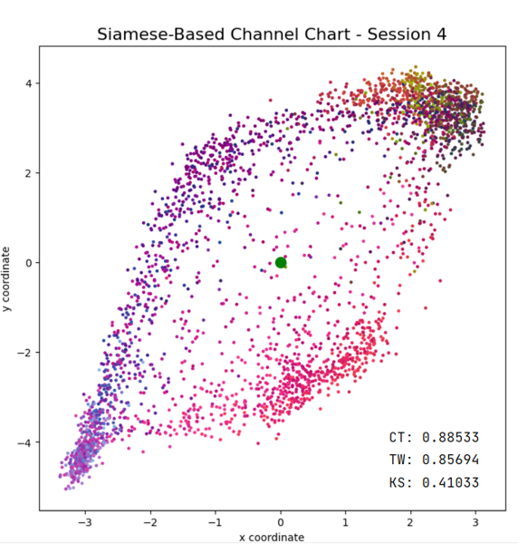
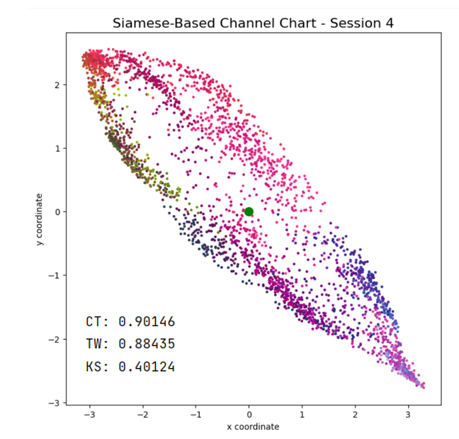
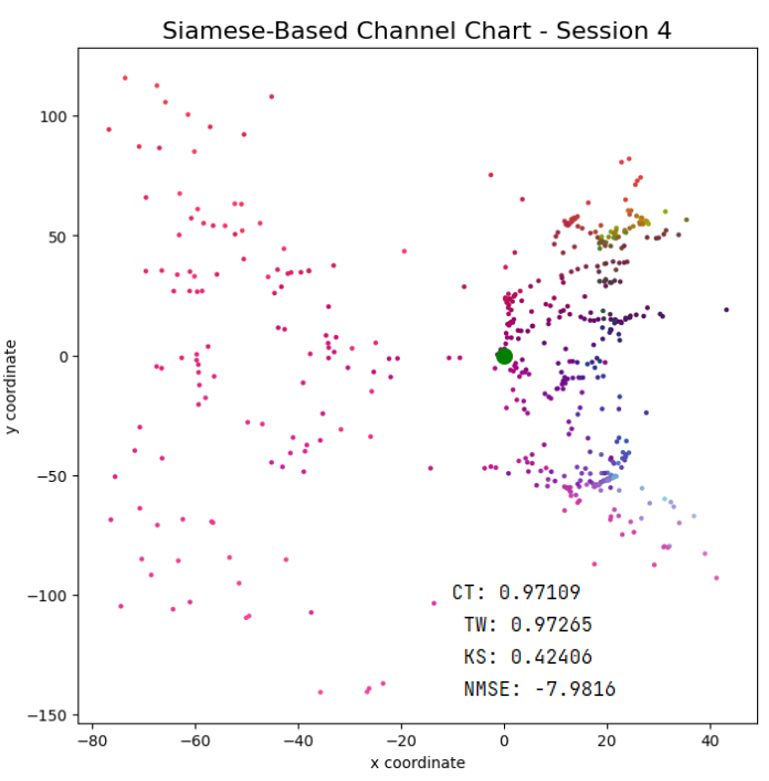
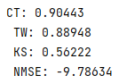

**场景**：


```python
num_segment = 5
num_bs = 3
dataset = torch.empty(0,dtype=torch.complex64)
for i in range(num_bs):
    temp2 = torch.empty(0,dtype=torch.complex64)
    for j in range(num_segment):
        temp = scipy.io.loadmat(r"E:\Quadriga_channel\Quadriga_64T4R_ScNum204_TtiNum1_UeSegment"+str(j+1)+"_BsId"+str(i+1)+"_DS363.mat")
        temp2 = torch.cat((temp2, torch.tensor(temp['Hfreq'][0,:,:,0].swapaxes(1,2).swapaxes(0,1))))
    temp2 = temp2.unsqueeze(1)
    dataset = torch.cat((dataset,temp2),dim=1)
positions = scipy.io.loadmat(r"E:\QuadrigaChannelChartingQuadriga\UePosFileForCC.mat")
num_loc = num_segment * 1000
locs=positions['PosFix'][:2,:num_loc].swapaxes(0,1)

def scaling(channel,sigma=16,antennas=16):
    #### Function which normalizes channels w.r.t their norm

    beta=1+(1/(2*sigma))
    norm=torch.linalg.norm(channel)
    if norm==0:
        return torch.zeros(channel.shape)
    return antennas**(beta-1)*channel/norm**beta

csi_time = torch.zeros((dataset.shape[0],dataset.shape[1],dataset.shape[2],dataset.shape[3]))
csi_time = torch.tensor(dataset)
csi_time = fft.fft(fft.fftshift(fft.ifft(fft.fftshift(csi_time, dim=-1)),dim=-1), dim = -2)
# csi_r2m = csi_time[...,16:32,:]
csi_r2m = csi_time
csi_r2m = torch.stack([torch.stack([torch.matmul(bs, torch.conj(bs).T) for bs in usr]) for usr in csi_r2m])
csi_r2m = torch.stack([torch.stack([scaling(bs) for bs in usr]) for usr in csi_r2m]) ## scale matrices
csi_r2m = torch.stack((torch.real(csi_r2m), torch.imag(csi_r2m))) ### split real and imaginary values
csi_r2m = csi_r2m.swapaxes(0, 1).swapaxes(1, 2) ### swap axis so that real-im split would be after users and after BS?
channels_min = torch.min(csi_r2m)
channels_max = torch.max(csi_r2m)
csi_r2m = 2*(csi_r2m-channels_min)/(channels_max-channels_min)-1
num_OFDM = 16

# 定义Encoder部分
class Encoder(nn.Module):
    def __init__(self):
        super(Encoder, self).__init__()
        # self.feature_layer = FeatureEngineeringLayer()
        # self.activation = nn.Tanh()
        self.conv1 = nn.Conv2d(2, 16, kernel_size=(2, 2), stride=1, padding=0)
        self.batch_norm1 = nn.BatchNorm2d(16)
        self.conv2 = nn.Conv2d(16, 32, kernel_size=(2, 2), stride=1, padding=0)
        self.batch_norm2 = nn.BatchNorm2d(32)
        self.maxpool = nn.MaxPool2d(kernel_size=(2, 2), stride=1)
        self.conv3 = nn.Conv2d(32, 32, kernel_size=(2, 2), stride=1, padding=0)
        self.batch_norm3 = nn.BatchNorm2d(32)
        self.conv4 = nn.Conv2d(32, 64, kernel_size=(2, 2), stride=1, padding=0)
        self.batch_norm4 = nn.BatchNorm2d(64)
        self.global_maxpool = nn.AdaptiveMaxPool2d((1, 1))
        self.flatten = nn.Flatten(1, 3)
        self.fc = nn.Linear(64, 64)
        self.batch_norm5 = nn.BatchNorm1d(64)

    def forward(self, x):
        # x = self.feature_layer(x)
        # x = self.activation(x)
        x = self.conv1(x)
        x = F.relu(x)
        x = self.batch_norm1(x)
        x = self.conv2(x)
        x = F.relu(x)
        x = self.batch_norm2(x)
        x = self.maxpool(x)
        x = self.conv3(x)
        x = F.relu(x)
        x = self.batch_norm3(x)
        x = self.conv4(x)
        x = F.relu(x)
        x = self.batch_norm4(x)
        x = self.global_maxpool(x)
        x = self.flatten(x)
        x = self.fc(x)
        x = F.relu(x)
        x = self.batch_norm5(x)
        return x

# 定义Decoder部分
class Decoder(nn.Module):
    def __init__(self):
        super(Decoder, self).__init__()
        self.fc1 = nn.Linear(64, 125)
        self.batch_norm = nn.BatchNorm1d(125)
        self.conv_transpose1 = nn.ConvTranspose2d(5, 64, kernel_size=(2, 2), stride=1, padding=0)
        self.batch_norm1 = nn.BatchNorm2d(64)
        self.conv_transpose2 = nn.ConvTranspose2d(64, 32, kernel_size=(2, 2), stride=1, padding=0)
        self.batch_norm2 = nn.BatchNorm2d(32)
        self.up_sampling = nn.Upsample(scale_factor=2)
        self.conv_transpose3 = nn.ConvTranspose2d(32, 32, kernel_size=(2, 2), stride=1, padding=0)
        self.batch_norm3 = nn.BatchNorm2d(32)
        self.conv_transpose4 = nn.ConvTranspose2d(32, 2, kernel_size=(2, 2), stride=1, padding=0)
        self.batch_norm4 = nn.BatchNorm2d(2)
        # self.complex_csi_layer = ComplexCsiLayer()
        self.activation = nn.Tanh()

    def forward(self, x):
        x = self.fc1(x)
        x = F.relu(x)
        x = self.batch_norm(x)
        x = x.view(x.size(0),5, 5, 5)
        x = self.conv_transpose1(x)
        x = F.relu(x)
        x = self.batch_norm1(x)
        x = self.conv_transpose2(x)
        x = F.relu(x)
        x = self.batch_norm2(x)
        x = self.up_sampling(x)
        x = self.conv_transpose3(x)
        x = F.relu(x)
        x = self.batch_norm3(x)
        x = self.conv_transpose4(x)
        x = F.relu(x)
        x = self.batch_norm4(x)
        x = self.activation(x)
        return x

class Autoencoder(nn.Module):
    def __init__(self, num_bs):
        super(Autoencoder, self).__init__()
        self.encoders = nn.ModuleList([Encoder() for _ in range(num_bs)])
        self.fusion = nn.Sequential(
            # nn.Linear(64, 64),
            # nn.ReLU(),
            # nn.BatchNorm1d(64),
            nn.Linear(64, 24),
            nn.ReLU(),
            nn.BatchNorm1d(24),
            nn.Linear(24, 2),
        )
        self.defusion = nn.Sequential(
            nn.Linear(2, 24),
            nn.ReLU(),
            nn.BatchNorm1d(24),
            nn.Linear(24, 64),
            nn.ReLU(),
            nn.BatchNorm1d(64),
            nn.Linear(64,64),
            nn.ReLU(),
            nn.BatchNorm1d(64)
        )
        self.decoders = nn.ModuleList([Decoder() for _ in range(num_bs)])

    def forward(self, inputs):
        encoders_output = []
        for i, encoder in enumerate(self.encoders):
            output = encoder(inputs[:, i, ...])
            encoders_output.append(output)
        # 确保 encoders_output 不为空
        if not encoders_output:
            raise ValueError("No valid encoder outputs were generated.")
        sum_encoder_outputs = torch.sum(torch.stack(encoders_output, dim=1), dim=1)
        fusion_output = self.fusion(sum_encoder_outputs)
        defusion_output = self.defusion(fusion_output)
        decoders_output = [decoder(defusion_output) for decoder in self.decoders]
        outputs = torch.stack(decoders_output, dim=1)
        return outputs, fusion_output

batch_size = 10
train_ratio = 0.8
lr = 5e-5
beta = 18
num_ue = csi_r2m.shape[0]
num_train_users = int(train_ratio * num_ue)
train_users, test_users = train_test_split(np.arange(num_ue), train_size=train_ratio, shuffle=True, random_state=42)
csi_r2m = csi_r2m.to(torch.float)
train_dataset = csi_r2m[train_users, ...]
test_dataset = csi_r2m[test_users, ...]
test_pos = locs[test_users, ...]
train_dataset = TensorDataset(train_dataset)
train_loader = DataLoader(train_dataset, batch_size=batch_size, shuffle=True)
# 定义损失函数
def custom_loss(y_true, y_pred, CC , beta=18):
    csi_true = y_true
    csi_pred = y_pred
    reconstruction_loss = torch.sum(torch.norm(csi_true - csi_pred, dim=(-2, -1)))/(2*batch_size)
    regularization_term = torch.norm(model.fusion[0].weight)**2 + torch.norm(model.fusion[3].weight)**2
    loss = reconstruction_loss + 0.5 * beta * regularization_term
    return loss

# 初始化模型和优化器
model = Autoencoder(num_bs)
criterion=nn.MSELoss(reduction='sum')
optimizer = optim.Adam(model.parameters(), lr=lr)

# 模型训练

epochs = 130
for epoch in range(epochs):
    total_loss = 0.0
    for batch in tqdm(train_loader, desc=f'Epoch {epoch + 1}/{epochs}', unit='batch'):
        optimizer.zero_grad()
        inputs = batch[0]
        outputs, CC = model(inputs)
        loss = custom_loss(inputs, outputs,CC,beta=beta)
        # loss = criterion(outputs, inputs) / batch_size
        loss.backward()
        optimizer.step()
        total_loss += loss.item()
    average_loss = total_loss / len(train_loader)
    print(f'Epoch {epoch + 1}/{epochs}, Average Loss: {average_loss}')
```


epoch =130


**采用频域csi**


## Siamese CNN 网络


```python
    fusion = tf.keras.Sequential([
        tf.keras.layers.Dense(64, activation = "relu", kernel_regularizer=tf.keras.regularizers.l2(8)),
        tf.keras.layers.BatchNormalization(),
        tf.keras.layers.Dense(24, activation = "relu", kernel_regularizer=tf.keras.regularizers.l2(8)),
        tf.keras.layers.BatchNormalization(),
        tf.keras.layers.Dense(2, activation = "linear", kernel_regularizer=tf.keras.regularizers.l2(8)),
    ])
```


**$\beta = 12$**


## Siamese DNN

```python
num_OFDM = 128
class FeatureEngineeringLayer(tf.keras.layers.Layer):
	def __init__(self):
		super(FeatureEngineeringLayer, self).__init__(dtype = tf.complex64)

	def call(self, csi):
            sample_r2m = tf.einsum("damt,dbnt->damn", csi, tf.math.conj(csi))
            # return tf.stack([tf.math.real(sample_r2m), tf.math.imag(sample_r2m)], axis = -1)
            return sample_r2m
def create_DNN(input_shape, name):
    cc_embmodel_input = tf.keras.Input(shape=input_shape, name="DNN_input", dtype = tf.complex64)
    cc_embmodel_output = FeatureEngineeringLayer()(cc_embmodel_input)
    cc_embmodel_output = tf.keras.layers.Flatten()(cc_embmodel_output)
    cc_embmodel_output = tf.keras.layers.Dense(1024, activation = "relu")(cc_embmodel_output)
    cc_embmodel_output = tf.keras.layers.BatchNormalization()(cc_embmodel_output);
    cc_embmodel_output = tf.keras.layers.Dense(512, activation = "relu")(cc_embmodel_output)
    cc_embmodel_output = tf.keras.layers.BatchNormalization()(cc_embmodel_output)
    cc_embmodel_output = tf.keras.layers.Dense(256, activation = "relu")(cc_embmodel_output)
    cc_embmodel_output = tf.keras.layers.BatchNormalization()(cc_embmodel_output)
    cc_embmodel_output = tf.keras.layers.Dense(128, activation = "relu")(cc_embmodel_output)
    cc_embmodel_output = tf.keras.layers.BatchNormalization()(cc_embmodel_output)
    DNN_model = tf.keras.Model(inputs=cc_embmodel_input, outputs=cc_embmodel_output, name=name)
    return DNN_model

def create_fusion(num_bs, num_an, num_OFDM):
    fusion_input = tf.keras.Input(shape=(num_bs,2, num_an, num_OFDM,), name="fusion_input", dtype = tf.complex64)
    fusion = tf.keras.Sequential([
        tf.keras.layers.Dense(64, activation = "relu", kernel_regularizer=tf.keras.regularizers.l2(12)),
        tf.keras.layers.BatchNormalization(),
        tf.keras.layers.Dense(24, activation = "relu", kernel_regularizer=tf.keras.regularizers.l2(12)),
        tf.keras.layers.BatchNormalization(),
        tf.keras.layers.Dense(2, activation = "linear", kernel_regularizer=tf.keras.regularizers.l2(12)),
    ])
    embedding_list = []
    for i in range(num_bs):
        cc_embmodel = create_DNN((2,num_an,num_OFDM), name=f"siamese_{i+1}")
        embedding = cc_embmodel(fusion_input[:,i,...])
        embedding_list.append(embedding)
    embedding_sum = tf.keras.backend.sum(embedding_list, axis=0)
    fusion_output = fusion(embedding_sum)
    fusion_model = tf.keras.Model(inputs=fusion_input, outputs=fusion_output)
    return fusion_model


input_A = tf.keras.layers.Input(shape = (num_bs,2, num_an,num_OFDM,), dtype = tf.complex64)
input_B = tf.keras.layers.Input(shape = (num_bs,2, num_an,num_OFDM,), dtype = tf.complex64)
fusion_model = create_fusion(num_bs, num_an, num_OFDM)

A_output = fusion_model(input_A)
B_output = fusion_model(input_B)
output = tf.keras.layers.concatenate([A_output, B_output], axis=1)
siamese_model = tf.keras.models.Model([input_A, input_B], output, name = "SiameseNeuralNetwork")


dissimilarity_margin = np.quantile(dissimilarity_matrix_geodesic, 0.01)

def siamese_loss(y_true, y_pred):
    y_true = y_true[:,0]
    pos_A, pos_B = (y_pred[:,:2], y_pred[:,2:])
    distances_pred = tf.math.reduce_euclidean_norm(pos_A - pos_B, axis = 1)
    regularization_loss = tf.math.add_n(fusion_model.losses)
    return tf.reduce_mean(tf.square(distances_pred - y_true) / (y_true + dissimilarity_margin)) + regularization_loss
optimizer = tf.keras.optimizers.Adam()
siamese_model.compile(loss = siamese_loss, optimizer = optimizer)

samples_per_session = 100000
# learning_rates = [5e-5, 5e-5, 5e-5,5e-5]
# batch_size = [16, 16, 16, 50]
learning_rates = [5e-5, 3e-5, 1e-5, 5e-6]
batch_size = [25, 50, 100, 100]

for l in range(len(learning_rates)):
    print("\nTraining Session ", l + 1, "\nBatch Size: ", batch_size[l], "\nLearning rate: ", learning_rates[l])

    # Fit model
    optimizer.learning_rate.assign(learning_rates[l])
    siamese_model.fit(random_pair_dataset.batch(batch_size[l]).prefetch(tf.data.AUTOTUNE), steps_per_epoch = samples_per_session // batch_size[l])

    # Plot Channel Chart
    print("Running inference to plot channel chart")
    channel_chart_positions = fusion_model.predict(csi_time_domain)
    plot_colorized(channel_chart_positions, groundtruth_positions, title = "Siamese-Based Channel Chart - Session " + str(l + 1))


# Continuity is identical to trustworthiness, except that original space and embedding space are swapped
def continuity(*args, **kwargs):
	args = list(args)
	args[0], args[1] = args[1], args[0]
	return trustworthiness(*args, **kwargs)

def kruskal_stress(X, X_embedded):
	dist_X = distance_matrix(X, X)
	dist_X_embedded = distance_matrix(X_embedded, X_embedded)
	beta = np.divide(np.sum(dist_X * dist_X_embedded), np.sum(dist_X_embedded * dist_X_embedded))

	return np.sqrt(np.divide(np.sum(np.square((dist_X - beta * dist_X_embedded))), np.sum(dist_X * dist_X)))

# Evaluate CT / TW / KS on a subset of the whole dataset
subset_indices = random.sample(range(len(groundtruth_positions)), len(groundtruth_positions) // 5)
groundtruth_positions_subset = groundtruth_positions[subset_indices]
channel_chart_positions_subset = channel_chart_positions[subset_indices]
plot_colorized(groundtruth_positions_subset, groundtruth_positions_subset, title="Ground Truth Positions")
ct = continuity(groundtruth_positions_subset, channel_chart_positions_subset, n_neighbors = int(0.05 * len(groundtruth_positions_subset)))
tw = trustworthiness(groundtruth_positions_subset, channel_chart_positions_subset, n_neighbors = int(0.05 * len(groundtruth_positions_subset)))
ks = kruskal_stress(groundtruth_positions_subset, channel_chart_positions_subset)

print("CT: {} \nTW: {} \nKS: {}".format(*np.around((ct, tw, ks), 5)))
```
注意此时的网络输入是(3000,3,2,32,128)





取模值平方后将用户天线与极化维度直接平均后作为DNN输入

1. 原始csi数据，5000用户点，3个基站，4根用户天线，63根基站天线，408OFDM子载波，$csi(5000,3,4,64,408)$
2. 将天线按照极化顺序排布，双极化，4行8列天线，$csi(5000,3,4,2,4,8,408)$
3. 在OFDM维度做IDFT在天线的行与列做二维DFT，将csi转换到角度时延域，在时延域加窗，窗长128，$csi(5000,3,4,2,4,8,128)$。
4. csi取模值平方后在极化维度与用户天线维度取平均$csi(5000,3,4,8,408)$作为网络的输入

**3000个用户3基站**：


**3000个用户单基站**：
beta = 15


**5000用户3基站**：


**5000用户单基站**：


## Siamese DNN + Autoencoder

### 网络结构


$$\mathcal{L}_{\mathrm{Siamese}}=\sum_{i=1}^{N-1}\sum_{j=i+1}^{N}\left(d_{i,j}-\|\mathbf{z}_i-\mathbf{z}_j\|_2\right)^2 + \left(||\mathbf{W}_{fc2}||_F^2+||\mathbf{W}_{fc24}||_F^2+||\mathbf{W}_{fc64}||_F^2\right)$$

$$\mathcal{L}_{\mathrm{Auto}}=\frac{1}{2U}\sum_{b=1}^{B}\sum_{u=1}^{U}||f_u^b - z_u^b||_2^2$$

$$\mathcal{L} = \mathcal{L}_{\mathrm{Siamese}} + \mathcal{L}_{\mathrm{Auto}}$$

### 网络代码

```python
def continuity(*args, **kwargs):
	args = list(args)
	args[0], args[1] = args[1], args[0]
	return trustworthiness(*args, **kwargs)

def kruskal_stress(X, X_embedded):
	dist_X = distance_matrix(X, X)
	dist_X_embedded = distance_matrix(X_embedded, X_embedded)
	beta = np.divide(np.sum(dist_X * dist_X_embedded), np.sum(dist_X_embedded * dist_X_embedded))
	return np.sqrt(np.divide(np.sum(np.square((dist_X - beta * dist_X_embedded))), np.sum(dist_X * dist_X)))

def NMSE(H_true, H_recons):
    nmse = np.mean(np.square(H_true - H_recons)) / np.var(H_true)
    nmse_dB = 10 * np.log10(nmse)
    return nmse_dB

num_OFDM = 32
num_an = 32
hiden_dim = 2
feature_dim = num_OFDM*num_an
class FeatureEngineeringLayer(tf.keras.layers.Layer):
	def __init__(self):
		super(FeatureEngineeringLayer, self).__init__(dtype = tf.float32)

	def call(self, csi):
            # sample_r2m = tf.reduce_mean(csi,axis=1)
            # sample_r2m = tf.einsum("damt,dbnt->damn", csi, tf.math.conj(csi))
            # return tf.stack([tf.math.real(sample_r2m), tf.math.imag(sample_r2m)], axis = -1)
            return csi
def create_encoder(input_shape, name):
    cc_embmodel_input = tf.keras.Input(shape=input_shape, name="DNN_input", dtype = tf.float32)
    cc_embmodel_output = FeatureEngineeringLayer()(cc_embmodel_input)
    cc_embmodel_output = tf.keras.layers.Flatten()(cc_embmodel_output)
    cc_embmodel_output = tf.keras.layers.Dense(1024, activation = "relu")(cc_embmodel_output)
    cc_embmodel_output = tf.keras.layers.BatchNormalization()(cc_embmodel_output)
    cc_embmodel_output = tf.keras.layers.Dense(512, activation = "relu")(cc_embmodel_output)
    cc_embmodel_output = tf.keras.layers.BatchNormalization()(cc_embmodel_output)
    cc_embmodel_output = tf.keras.layers.Dense(256, activation = "relu")(cc_embmodel_output)
    cc_embmodel_output = tf.keras.layers.BatchNormalization()(cc_embmodel_output)
    cc_embmodel_output = tf.keras.layers.Dense(128, activation = "relu")(cc_embmodel_output)
    cc_embmodel_output = tf.keras.layers.BatchNormalization()(cc_embmodel_output)
    DNN_model = tf.keras.Model(inputs=cc_embmodel_input, outputs=cc_embmodel_output, name=name)
    return DNN_model
def create_decoder(input_shape,feature_dim, name):
    cc_embmodel_input = tf.keras.Input(shape=input_shape, name="DNN_input", dtype = tf.float32)
    # cc_embmodel_output = tf.keras.layers.Dense(128, activation = "relu")(cc_embmodel_output)
    # cc_embmodel_output = tf.keras.layers.BatchNormalization()(cc_embmodel_output);
    cc_embmodel_output = tf.keras.layers.Dense(256, activation = "relu")(cc_embmodel_input)
    cc_embmodel_output = tf.keras.layers.BatchNormalization()(cc_embmodel_output)
    cc_embmodel_output = tf.keras.layers.Dense(512, activation = "relu")(cc_embmodel_output)
    cc_embmodel_output = tf.keras.layers.BatchNormalization()(cc_embmodel_output)
    cc_embmodel_output = tf.keras.layers.Dense(1024, activation = "relu")(cc_embmodel_output)
    cc_embmodel_output = tf.keras.layers.BatchNormalization()(cc_embmodel_output)
    cc_embmodel_output = tf.keras.layers.Dense(feature_dim, activation = "linear")(cc_embmodel_output)
    DNN_model = tf.keras.Model(inputs=cc_embmodel_input, outputs=cc_embmodel_output, name=name)
    return DNN_model

def create_fusion(num_bs, num_an, num_OFDM, hiden_dim):
    fusion_input = tf.keras.Input(shape=(num_bs,num_an, num_OFDM,), name="fusion_input", dtype = tf.float32)
    fusion = tf.keras.Sequential([
        tf.keras.layers.Dense(64, activation = "relu", kernel_regularizer=tf.keras.regularizers.l2(15)),
        tf.keras.layers.BatchNormalization(),
        tf.keras.layers.Dense(24, activation = "relu", kernel_regularizer=tf.keras.regularizers.l2(15)),
        tf.keras.layers.BatchNormalization(),
        tf.keras.layers.Dense(hiden_dim, activation = "linear", kernel_regularizer=tf.keras.regularizers.l2(18)),
    ])
    embedding_list = []
    for i in range(num_bs):
        cc_embmodel = create_encoder((num_an,num_OFDM), name=f"encoder_{i+1}")
        embedding = cc_embmodel(fusion_input[:,i,...])
        embedding_list.append(embedding)
    embedding_sum = tf.keras.backend.sum(embedding_list, axis=0)
    fusion_output = fusion(embedding_sum)
    fusion_model = tf.keras.Model(inputs=fusion_input, outputs=fusion_output)
    return fusion_model
def create_defusion(num_bs, num_an, num_OFDM, hiden_dim, feature_dim):
    defusion_input = tf.keras.Input(shape=(hiden_dim), name="fusion_input", dtype = tf.float32)
    defusion = tf.keras.Sequential([
        tf.keras.layers.Dense(24, activation = "relu", kernel_regularizer=tf.keras.regularizers.l2(15)),
        tf.keras.layers.BatchNormalization(),
        tf.keras.layers.Dense(64, activation = "relu", kernel_regularizer=tf.keras.regularizers.l2(15)),
        tf.keras.layers.BatchNormalization(),
        tf.keras.layers.Dense(128, activation = "relu", kernel_regularizer=tf.keras.regularizers.l2(18)),
        tf.keras.layers.BatchNormalization(),
    ])
    decoder_input = defusion(defusion_input)
    embedding_list = []
    for i in range(num_bs):
        cc_embmodel = create_decoder((128),feature_dim, name=f"decoder_{i+1}") ##注意decoder输入的维度
        embedding = cc_embmodel(decoder_input)
        embedding_list.append(embedding)
    embedding_sum = tf.stack(embedding_list, axis=1)
    defusion_output = tf.reshape(embedding_sum, (-1, num_bs, num_an,num_OFDM,))  ######这个reshape有问题，none维度被去掉了！！！！
    defusion_model = tf.keras.Model(inputs=defusion_input, outputs=defusion_output)
    return defusion_model


input_A = tf.keras.layers.Input(shape = (num_bs, num_an,num_OFDM,), dtype = tf.float32)
input_B = tf.keras.layers.Input(shape = (num_bs, num_an,num_OFDM,), dtype = tf.float32)
fusion_model = create_fusion(num_bs, num_an, num_OFDM,hiden_dim)
A_fusion = fusion_model(input_A)
B_fusion = fusion_model(input_B)
defusion_model = create_defusion(num_bs, num_an, num_OFDM, hiden_dim, feature_dim)

A_output = defusion_model(A_fusion)
B_output = defusion_model(B_fusion)
A_output = tf.stack([input_A, A_output], axis=1)
B_output = tf.stack([input_B, B_output], axis=1)

reconstruction_output = tf.stack([A_output, B_output], axis=1)
CC_output = tf.keras.layers.concatenate([A_fusion, B_fusion], axis=1)
siamese_model = tf.keras.models.Model([input_A, input_B], [CC_output, reconstruction_output], name = "SiameseNeuralNetwork")


dissimilarity_margin = np.quantile(dissimilarity_matrix_geodesic, 0.01)

def siamese_loss(y_true, y_pred):
    y_true = y_true[:,0]
    pos_A, pos_B = (y_pred[:,:2], y_pred[:,2:])
    distances_pred = tf.math.reduce_euclidean_norm(pos_A - pos_B, axis = 1)
    regularization_loss = tf.math.add_n(fusion_model.losses)
    return tf.reduce_mean(tf.square(distances_pred - y_true) / (y_true + dissimilarity_margin)) + regularization_loss

def reconstrution_loss(y_true, y_pred):
    data_A, data_B = (y_pred[:,0,0], y_pred[:,1,0])
    pre_A, pre_B = (y_pred[:,0,1], y_pred[:,1,1])
    A_loss = tf.reduce_mean(tf.math.reduce_euclidean_norm(data_A - pre_A, axis=(-2, -1)))
    B_loss = tf.reduce_mean(tf.math.reduce_euclidean_norm(data_B - pre_B, axis=(-2, -1)))
    reconstruction_loss = (A_loss + B_loss)/2
    return reconstruction_loss

optimizer = tf.keras.optimizers.Adam()
siamese_model.compile(loss=[siamese_loss, reconstrution_loss], optimizer = optimizer)

samples_per_session = 100000
# learning_rates = [5e-5, 5e-5, 5e-5,5e-5]
# batch_size = [16, 16, 16, 50]
learning_rates = [7e-5, 3e-5, 1e-5, 5e-6]
batch_size = [25, 50, 100, 100]

for l in range(len(learning_rates)):
    print("\nTraining Session ", l + 1, "\nBatch Size: ", batch_size[l], "\nLearning rate: ", learning_rates[l])

    optimizer.learning_rate.assign(learning_rates[l])
    siamese_model.fit(random_pair_dataset.batch(batch_size[l]).prefetch(tf.data.AUTOTUNE), steps_per_epoch = samples_per_session // batch_size[l])

    print("Running inference to plot channel chart")
    channel_chart_positions = fusion_model.predict(csi_time_domain)
    csi_reconstrction = defusion_model.predict(channel_chart_positions)
    plot_colorized(channel_chart_positions, groundtruth_positions,BSs, title = "Siamese-Based Channel Chart - Session " + str(l + 1))
    ## 计算指标
    subset_indices = random.sample(range(len(groundtruth_positions)), len(groundtruth_positions) // 5)
    groundtruth_positions_subset = groundtruth_positions[subset_indices]
    channel_chart_positions_subset = channel_chart_positions[subset_indices]
    csi_subset = csi_time_domain[subset_indices]
    csi_reconstrction_subset = csi_reconstrction[subset_indices]
    ct = continuity(groundtruth_positions_subset, channel_chart_positions_subset, n_neighbors = int(0.05 * len(groundtruth_positions_subset)))
    tw = trustworthiness(groundtruth_positions_subset, channel_chart_positions_subset, n_neighbors = int(0.05 * len(groundtruth_positions_subset)))
    ks = kruskal_stress(groundtruth_positions_subset, channel_chart_positions_subset)
    nmse = NMSE(csi_subset, csi_reconstrction_subset)
    print("CT: {} \n TW: {} \n KS: {} \n NMSE: {}".format(*np.around((ct, tw, ks, nmse), 5)))

```
### 训练结果

#### **csi预处理，取模求平均**

**csi预处理：**

1. 原始csi数据，5000用户点，3个基站，4根用户天线，63根基站天线，408OFDM子载波，$csi(5000,3,4,64,408)$
2. 将天线按照极化顺序排布，双极化，4行8列天线，$csi(5000,3,4,2,4,8,408)$
3. 在OFDM维度做IDFT在天线的行与列做二维DFT，将csi转换到角度时延域，在时延域加窗，窗长128，$csi(5000,3,4,2,4,8,64)$。
4. csi取模值平方后在极化维度与用户天线维度取平均$csi(5000,3,4,8,64)$作为网络的输入
  
- **单基站隐藏层hiden_dim=2**
单基站


- **3基站隐藏层hiden_dim=2**


随着学习率的增加CT,TW指标先上升后下降，NMSE随着学习次数增加而增加

- **增加隐藏层hiden_dim=16**
```python
learning_rates = [7e-5, 3e-5, 1e-5, 7e-4]
batch_size = [25, 50, 100, 100]
```


- **增加隐藏层hiden_dim=64**
```python
learning_rates = [5e-4, 3e-4, 7e-5, 5e-5]
batch_size = [25, 50, 100, 100]
```


- **增加隐藏层hiden_dim=128**

```python
learning_rates = [1e-4, 5e-5, 1e-5, 5e-6]
batch_size = [25, 50, 100, 100]
```


- **增加隐藏层hiden_dim=256**

```python
learning_rates = [5e-4, 1e-4, 5e-5, 1e-5]
batch_size = [25, 50, 100, 100]
```


#### 数据整理


#### **csi预处理，求子带协方差平均**

**csi预处理：**

1. 原始csi数据，5000用户点，3个基站，4根用户天线，63根基站天线，408OFDM子载波，$csi(5000,3,4,64,408)$
2. 将子载波分为17个子带，每个子带24个子载波，在每个自带内求协方差，$csi(5000,3,4,2,4,8,17,17)$，随后17个子带协方差平均，$csi(5000,3,4,2,4,8,17)$
3. 将天线按照极化顺序排布，双极化，4行8列天线，$csi(5000,3,4,2,4,8,17)$
4. 在OFDM维度做IDFT在天线的行与列做二维DFT，将csi转换到角度时延域，$csi(5000,3,4,2,4,8,17)$。
5. csi取模值平方后在极化维度与用户天线维度取平均$csi(5000,3,4,8,17)$作为网络的输入

- **单基站 hiden_dim=2**


- **3基站 hiden_dim=2**


- **3基站 hiden_dim=128**


#### **csi预处理，子带求平均求空域协方差**

```python
dataset = dataset.view(num_loc,num_bs,4,64,17,24)# 将 408 个子载波按照 17 个子带进行划分
dataset = torch.mean(dataset, dim=-1)
subband_cov_matrices = torch.matmul(dataset, dataset.transpose(-2, -1)) / 17  # 计算协方差矩阵时除以子载波数量
```

- **3基站 hiden_dim=128**
```python
learning_rates = [5e-4, 3e-4, 1e-4, 5e-5]
batch_size = [25, 50, 100, 100]
```


```python
learning_rates = [6e-4, 4e-4, 1e-4, 7e-5]
batch_size = [25, 50, 100, 100]
```


- **3基站 hiden_dim=64**


- **3基站 hiden_dim=32**


- **3基站 hiden_dim=16**


- **3基站 hiden_dim=2**


- **单基站 hiden_dim=128**


- **单基站 hiden_dim=64**


- **单基站 hiden_dim=32**



**PCA**
- 计算数据的均值
- 数据中心化
- 计算数据的协方差矩阵
- 进行特征值分解
- 选择最大的两个特征值对应的特征向量
- 将数据映射到主成分空间


