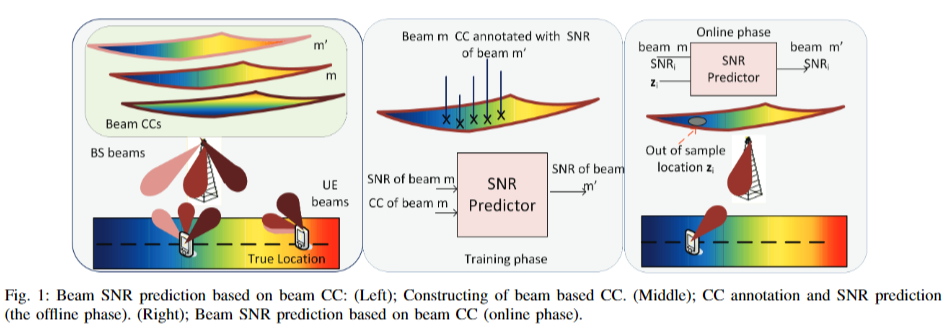

---

## 十、Location-Free Beam Prediction in mmWave Systems

提出了一种基于通道图谱的框架，通过利用用户当前所在小区的通道图谱来预测下一个传输时刻移动用户的最佳基站波束。使用QuaDRiGa信道生成器模拟了通道，并使用通道图谱进行预测。

### 建模

当UE在波束$v_n$上发送时，在BS处使用波束$w_m$的子载波中从UE u接收的信号是:

$$
    y^{u,s}_{m,n} = w^H_m H_{u,s}v_n x_s + n_u = h^{u,s}_{m,n} x + n_u
$$

其中$h^{u,s}_n = W_HH_{u,s}v_n$是BS波束m和UE波束n的有效信道系数。而从使用波束$v_n$的UE传输的BS处的所有波束测量的有效信道矢量为：$h^{u,s}_{m,n} = W^H H_{u,s}v_n$。

对于每个BS波束，存在最佳UE波束，它由下式决定：

$$
    \hat{n} = \hat{n}(m) = \underset{n}{argmax}\ \ \mathbb{E}{| h^{u,s}_{m,n} |^2}
$$

BS不知道UE使用哪个波束，只知道它应该向哪个BS波束发送和从哪个BS波束接收。BS波束和UE基带接收机之间的信道矢量因此以UE关于BS使用哪个波束的假设为条件。如果UE假设BS使用波束m，则该信道矢量变为:

$$
    h^{u,s}_{\hat{n}(m)} = W_H H_{u,s}v_{\hat{n}(m)}
$$

### 建立CC进行波束预测

处理UE u的CSI协方差矩阵$R_u$以获得信道特征$f_u$，然后对BS所观测到的K个UEs建立相异度矩阵$D \in \mathbb{R}^{K \times K}_{+}$，其中的相异度d
由下式计算：

$$
    d_{CMD}(R_u,R_{u^{'}}) = 1 - \displaystyle \frac{Tr(R_u R_{u^{'}})}{||R_u||_F \ \ ||R_{u^{'}}||_F}
$$

本文使用了Isomaps和t-SNE进行降维得到了包含每个UE对应坐标的二维图表。BS根据接收到的信道向量$h^{u,s}_{\hat{n}(m)}$为每个BS波束构造单独的CC，其中不同位置处的UE以朝向$w_m$的最佳波束$v_n(m)$进行发射，而固定了UE波束$v_n$后，最佳BS波束由下式确定，并且用关于每个样本点的最佳BS波束的信息对所有CC进行注释，这使得能够进行最佳BS波束预测。

$$
    \hat{m} = \underset{m}{argmax}\mathbb{E}\{|h^{u,s}_{m,n(m)}|^2\}
$$

则UE uc朝向BS波束m的协方差矩阵为

$$
    R_{u,m} = \mathbb{E}\{h^{u,s}_{\hat{n(m)}}(h^{u,s}_{\hat{n(m)}})^H\}
$$

得到CC之后，预测阶段BS测量UE的CSI特征，并使用针对波束m的CC上的新UE位置的样本外扩展来获得CC坐标。通过计算新数据点的协方差与现有CC点的协方差的相异性并且将新数据点中的CC位置近似为与新UE具有最小相异性的图表UE的CC位置。根据采样点上的最佳波束的注释，BS可以推导出UE位置的最佳BS波束索引$\hat{m}$。

### 预测UE移动性

本文使用过去的两个CC位置$z_{t-1}$和$z_t$对未来第$(t+1)^{th}$时刻的CC位置$\hat{z}_{t+1}$做了简单线性预测。

### 改进方向

与基于物理位置的预测相比，本文所提出的基于CC的预测存在性能损失。这是依赖现有无线电接入网内部CSI进行定位而不是使用GPS信息的成本。

改进方向可能有：

- 改进CC的生成，例如使用现有更好的相异度度量ADP等，能够让CC更为贴近真实物理空间中的布局。
- 改进预测手段，例如使用基于神经网络的预测。

---

## 十一、Channel Charting Based Beam SNR Prediction

本文使用从降维CSI导出的信道图位置来考虑毫米波系统中的相邻波束SNR预测。使用特定于波束的信道图，其是特定BS波束的接收信号的无线电映射。设计了一种以网络为中心的小区内波束切换机制，其中所有过程都在BS执行。在训练/离线阶段，收集波束CC和SNR，并根据注释的CC位置训练SNR预测器。在在线阶段，根据在BS处接收到的CSI和服务波束SNR来预测新UE的SNR。使用K-近邻、高斯过程回归和神经网络来近似SNR映射函数。Levenberg-Marquardt和随机梯度下降对数用于训练NN的权重。RMSE用作性能度量。

本文问题建模与“Location-Free Beam Prediction in mmWave Systems”相差不大，区别在于本文并非使用最佳波束去注释CC而是用相邻波束的SNR进行注释。以网络为中心的模型如下图所示。训练阶段包括创建信道图、使用相邻波束SNR进行注释以及训练SNR预测器。在在线阶段，当前波束CC位置和SNR用于预测目标波束处的SNR。

以监督学习生成SNR预测函数$g_{m,m^{'}}(z_{m,u},\gamma_{m,u})$来预测向$w_m$的传输的信噪比,在线阶段预测过程为：

1. UE i 朝向BS波束m建立了通信，计算$R_{m,i}$
2. 使用CC的样本外扩展定位UE i 在CC上的新位置$z_{m,i}$ 
3. 基于CC位置$z_{m,i}$ 和测量得到的SNR$\gamma_{m,i}$确定UE所属的ICBH(小区内波束切换)分组。
4. 预测所有可能的ICBH目标波束的信噪比。基于$\gamma_{m,i}$和$\gamma_{m^{'},i}$的信噪比差，进行了ICBH决策。

本文使用了K最近邻(KNN)、高斯过程回归(GPR)和神经网络来找到预测函数$g_{m,m^{'}}(z_{m,u},\gamma_{m,u})$

### 未来工作

可以将小区内波束SNR预测方法将扩展到小区间波束SNR预测。