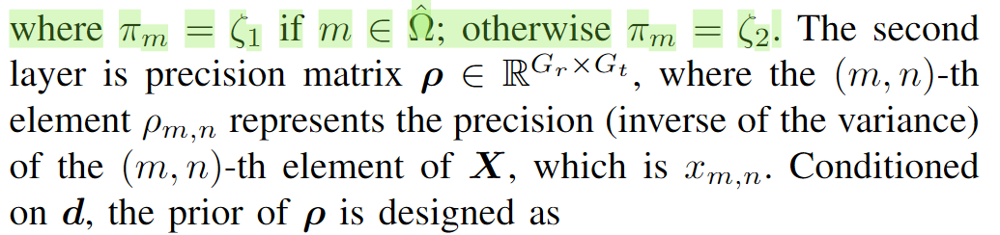

## Spatial Feature Aided Optimal Compressive Phase Training and Channel Estimation in Massive MIMO Systems with RIS

### 摘要 

在低导频开销下加速信道状态信息 (CSI) 采集一直是 RIS 辅助大规模 MIMO 系统的问题。RIS相移的设计在信道估计(CE)中起着关键作用。在本文中，我们将RIS的空间特征融入到基于变分贝叶斯推理的CE算法的设计中，该算法计算效率高，可以利用级联信道的稀疏结构。为了最优配置RIS对CE的相移，通过根据RIS相位制定CE性能指标，提出了一种最优相位训练算法和简化版本。数值模拟表明，与最先进的基线相比，所提出的 RIS 空间特征辅助最佳相位训练以及压缩 CE 算法以非常低的导频开销实现了卓越的 CE 性能。

### 问题建模

**重点**

这篇文章相比于之前的利用变分贝叶斯进行信道估计的方法，将历史信息提供的先验支撑整合进了贝叶斯推断的框架里，他的支撑先验信息是这么定义的：

PCSI中包含了支撑先验$\Omega$，最大行支撑$D$与最小行支撑$D_c$。他们的比例关系衡量了这个支撑信息的准确率。

分层概率模型：

其中

$$P(\boldsymbol{d})=\prod_{m=1}^{G_r}\pi_m^{d_m}(1-\pi_m)^{1-d_m},$$

这里相当于$P(d_m=1|m \in \Omega) = \frac{D_c}{D}$，$P(d_m=0|m \notin \Omega) = \frac{D-D_c}{G_r-\hat{D}}$

$$P(\boldsymbol{\rho}|\boldsymbol{d})=\prod_{m=1}^{G_r}\prod_{n=1}^{G_t}\Gamma(\rho_{m,n};a,b)^{d_m}\Gamma(\rho_{m,n};\bar{a},\bar{b})^{1-d_m}$$

至此文章将先验信息整合进了估计框架中。

**关于$\hat{\Omega}$的选取，原文中只取了上一个的估计值作为支撑先验，或许结合更多的历史信息会更加准确**

### 算法流程

> PSVBI就是利用支撑先验进行参数估计的流程，POPT是使用MM算法估计RIS的最佳相移的算法。

## Bayesian Channel Estimation in Multi-User Massive MIMO With Extremely Large Antenna Array

### 摘要

我们研究了多用户（MU）多输入单输出（MISO）OFDM系统的宽带上行链路信道估计，其中基站（BS）配备了超大天线阵列（ELAA）。由于球面波前和可见性区域（VR）问题引起的空间非平稳效应，现有的具有传统稀疏性提升先验模型的压缩感知大规模多输入多输出（MIMO）信道估计方法在ELAA场景中变得无效。因此，我们提出了一种新的具有隐马尔可夫模型（HMM）的结构化先验，以提高空间非平稳ELAA信道的结构化稀疏性。在此基础上，提出了一个关于ELAA信道系数后验的贝叶斯推理问题。此外，我们提出了turbo正交近似消息传递（turbo OAMP）算法来实现低复杂度的信道估计。综合仿真验证了与各种最先进的基线相比，所提出的算法在空间非平稳ELAA信道下具有最高的性能。

### 问题建模

> 在具有ELAA的MU大规模MIMO信道中有三个主要的结构特性：1）ELAA的同一区域中的天线对于同一组散射体可能是高概率可见的，2）延迟域中的信道脉冲响应是集群分布的，3）由于空间一致性，位置较近的MS可能共享局部集群。

来自第k个MS的第m个天线的第n个子载波处的频域信道响应如下式所示

$$\begin{aligned}&h_{m,k}[n]\\&=\sum_{l=1}^{L}\beta_{l,n,k}\frac{e^{-j2\pi\left(-\frac{1}{2}\lambda(m-1)\cos(\phi_{l,m})+d_{l}\cos(\Delta\phi_{l,m})\right)/\lambda}}{-\frac{1}{2}\lambda(m-1)\cos(\phi_{l,m})+d_{l}\cos(\Delta\phi_{l,m})}\\&\times e^{-j2\pi\frac{n}{N}\tau_{l,k}\upsilon_{l,m,k},}\end{aligned}$$

其中$\phi_{l,m}$是第l个来波到达第m根天线的AOA，$\Delta \phi_{l,m}$是第m条天线和第1条天线之间的AOA差，$\tau_{l,k}$是第L条线的延迟，$d_l$是第L个射线的最后一跳散射到第1个天线之间的距离。

在远场条件下研究了远场场景，其中$d_l$足够大，因此，∀m$\Delta \phi_{l,m}=0$。VR问题被忽略。

而在ELAA中$d_l$取瑞利距离，传统的基于DFT的角域信道基变得无效。

信道模型：

$$\mathrm{Y}_k=\mathrm{H}_k+\mathrm{W}_k$$

其中$\mathrm{H}_k=[\mathrm{h}_k[n_1],\ldots\mathrm{h}_k[n_p]]^{\mathrm{T}}\in\mathbb{C}^{P\times M}$，$n_p$是第p个导频子载波。

### ELAA信道在天线延迟域中的结构特性

这篇文章研究了四个方面的稀疏结构

- Structured sparsity for individual columns of $X_k$ 
  
$$b_{n,m,k}=\mathbf{1}(x_{n,m,k\neq0}).$$

- Structured sparsity for individual rows of $X_k$ 
  
  $$d_{n,m,k}=\mathbf{1}(x_{n,m,k\neq0})$$

- Common sparsity between columns of $X_k$ 

$$c_{n,k}=\mathbf{1}\left(\bigvee_mx_{n,m,k}\right)$$

- Common sparsity for rows between MSs $\{X_k\}$ 

$$s_{n,m}=\mathbf{1}\left(\bigvee_kx_{n,m,k}\right)$$

MU-ELAA信道的结构化先验模型如下图所示，四个马尔可夫链用于捕获MU-ELAA系统的相应结构化稀疏性。

传统的基于LASSO的方法通过在信道估计公式中添加基于1-范数的正则化来实现这一目标。然而，这种方法假设平面波阵面传播。此外，很难设计正则化来结合ELAA通道的精细结构特性。

以信道支撑为条件的信道系数是独立的，并且与伯努利-高斯分布相同，其分布为：

$$\begin{aligned}
p(x_{n,m,k}|\alpha_{n,m,k})& =(1-\alpha_{n,m,k})\delta(x_{n,m,k})  \\
&+\alpha_{n,m,k}\mathcal{CN}(x_{n,m,k};0,\sigma_{n,m,k}^{2})
\end{aligned}$$

$$\alpha_{n,m,k}=t_{n,m,k}\wedge r_{n,m,k},\forall n,m,k,$$

$$\begin{aligned}p(\alpha_{n,m,k}|t_{n,m,k},r_{n,m,k})&=t_{n,m,k}r_{n,m,k}\delta(1-\alpha_{n,m,k})\\&+(1-t_{n,m,k}r_{n,m,k})\delta(\alpha_{n,m,k}).\end{aligned}$$

### 构建支撑先验的分布

**1. $t_k$的结构化先验**

$$t_{n,m,k}=s_{n,m}\wedge d_{n,m,k},\forall n,m,k.$$

并使用马尔科夫链对$s_{n,m}$和$d_{n,k}$建模，具体如下：

$$p(\mathbf{d}_{n,k})=p(d_{n,1,k})\prod_{m=2}^Mp(d_{n,m,k}|d_{n,m-1,k})$$

$$\begin{aligned}p(\mathbf{s}_n)&=p(s_{n,1})\prod_{m=2}^{M}p(s_{n,m}|s_{n,m-1}),\forall n\end{aligned}$$

他们的联合分布为：

$$\begin{aligned}
p(\mathbf{t}_{k},\mathbf{d}_{k},\mathbf{s})& =p(\mathbf{t}_k|\mathbf{d}_k,\mathbf{s})p(\mathbf{d}_k)p(\mathbf{s})  \\
&\begin{aligned}=\prod_{n,m}p(t_{n,m,k}|d_{n,m,k},s_{n,m})p(d_{n,m,k})p(s_{n,m}).\end{aligned}
\end{aligned}$$

**1. $r_k$的结构化先验**

$$r_{n,m,k}=b_{n,m,k}\wedge c_{n,k},\forall n,m,k$$

使用马尔科夫链对$b_{m,k}$和$c_{k}$建模

$$p(\mathbf{b}_{m,k})=p(b_{1,m,k})\prod_{n=2}^Np(b_{n,m,k}|b_{n-1,m,k}),\forall m,k.$$

$$\begin{aligned}p(\mathbf{c}_k)&=p(c_{1,k})\prod_{n=2}^Np(c_{n,k}|c_{n-1,k}),\forall k\end{aligned}$$

他们的联合概率分布为：

$$\begin{aligned}
p(\mathbf{r}_{k},\mathbf{b}_{k},\mathbf{c}_{k})& =p(\mathbf{r}_k|\mathbf{b}_k,\mathbf{c}_k)p(\mathbf{b}_k)p(\mathbf{c}_k)  \\
&\begin{aligned}=\prod_{n,m}p(r_{n,m,k}|b_{n,m,k},c_{n,k})p(b_{n,m,k})p(c_{n,k}).\end{aligned}
\end{aligned}$$

目标是求出$x_{n,m,k}$的边缘后验概率分布$P(x_{n,m,k}|\mathbf{Y})$:

$$\begin{aligned}
&p(x_{n,m,k}|\mathbf{Y})\propto\int_{x_{n,m,k}^{-}}\sum p(\mathbf{Y,X,\alpha,t,r,c,s,b,d})  \\
&&&=\int_{x_{n,m,k}^-}\sum p(\mathbf{t}|\mathbf{d},\mathbf{s})p(\mathbf{r}|\mathbf{b},\mathbf{c})p(\mathbf{b})p(\mathbf{c})p(\mathbf{d})p(\mathbf{s}) \\
&&&\times\prod_{n,m,k}p(x_{n,m,k}|\alpha_{n,m,k})p(\alpha_{n,m,k}|t_{n,m,k},r_{n,m,k}) \\
&&&\times\prod_k\prod_{p,m}p(y_{p,m,k}|\mathbf{x}_{m,k}),
\end{aligned}$$

$$\begin{aligned}\hat{x}_{n,m,k}&=\operatorname{E}\left[x_{n,m,k}|\mathbf{Y}\right]\\&=\int_{x_{n,m,k}^-}x_{n,m,k}p(x_{n,m,k}|\mathbf{Y})\mathrm{d}x_{n,m,k}.\end{aligned}$$

### 信道恢复的Turbo-OAMP和消息传递算法

通常，Turbo框架将原始问题解耦为两个MMSE估计器:

$$\begin{aligned}\mathbf{P}_1:\quad\hat{x}_{n,m,k,A}&=\mathrm{E}\left[x_{n,m,k}|x_{n,m,k}^\mathrm{pri},\mathbf{Y}\right],\\\mathbf{P}_2:\quad\hat{x}_{n,m,k,B}&=\mathrm{E}\left[x_{n,m,k}|x_{n,m,k}^\mathrm{lik},\mathcal{S}\right],\end{aligned}$$

模块A是基于接收到的信号和来自模块B的输出消息的LMMSE估计器，模块B执行贝叶斯推断，该推断结合了结构化HMM先验和来自模块A的输出消息。

#### A：LMMSE估计器

将输入输出解相关后，LMMSE估计其的输出为：

$$\begin{aligned}
&v_{m,k,A}^{\mathrm{ext}} =\left(\frac1{v_{m,k,A}^\mathrm{post}}-\frac1{v_{m,k,A}^\mathrm{pri}}\right)^{-1},  \\
&\mathbf{x}_{m,k,A}^{\mathrm{ext}} =v_{m,k,A}^\mathrm{ext}\left(\frac{\mathbf{x}_{m,k,A}^\mathrm{post}}{v_{m,k,A}^\mathrm{post}}-\frac{\mathbf{x}_{m,k,A}^\mathrm{pri}}{v_{m,k,A}^\mathrm{pri}}\right). 
\end{aligned}$$

然后将模块A的输出作为模块B的输入：

$$
\begin{aligned}&\mathbf{x}_{m,k,B}^{\text{lik}} = \mathbf{x}_{m,k,A}^{\text{ext}} , \\ & v _ { m , k , B }^{\text{lik}} = v _ { m , k , A }^{\text{ext}} . \end{aligned}
$$

#### B：消息传递

此时因子图的因子分布为

随后依据和积法则更新因子节点和变量节点。

总体算法流程如下：

