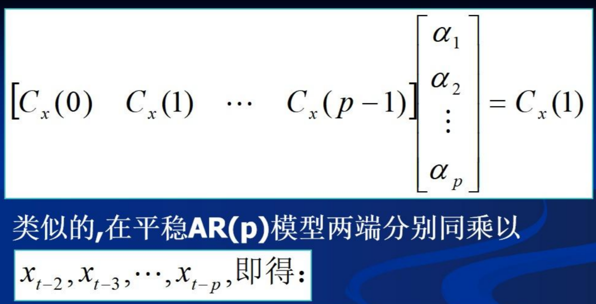

## Massive MIMO Channel Prediction: Kalman Filtering vs. Machine Learning

### 摘要

本文主要研究大规模多输入多输出（MIMO）系统的信道预测技术。以前的信道预测是基于理论信道模型的，这将偏离现实信道。在本文中，我们使用空间信道模型（SCM）中的真实信道开发并比较了基于矢量卡尔曼滤波器（VKF）的信道预测器和基于机器学习（ML）的信道预测器，该模型已在3GPP标准中采用多年。首先，我们在大规模MIMO中使用大量天线，提出了一种基于空间平均的低复杂度移动性估计器。移动性估计可以用于确定所开发的预测器的复杂度顺序。本文开发的基于VKF的信道预测器利用了基于Yule-Worker方程的SCM信道估计的自回归（AR）参数。然后，利用基于线性最小均方误差（LMMSE）的噪声预处理数据，开发了基于ML的信道预测器。数值结果表明，在信道预测精度和数据速率方面，两个信道预测器都比过时的信道具有显著的增益。基于ML的预测器比基于VKF的预测器具有更大的总体计算复杂度，但一旦训练，基于ML的预测因子的操作复杂度就会变得比基于V肯德基的预测因子更小。

### 问题建模

$$\underline{\mathrm{y}}_n=\bar{\Psi}_n\underline{\mathrm{h}}_n+\underline{\mathrm{w}}_n,$$

预测问题相当于优化以下问题：

$$\begin{aligned}
&\text{minimize} \left\|\underline{\mathbf{h}}_{n+1}-\underline{\hat{\mathbf{h}}}_{n+1}\right\|^2,  \\
&\text{subject to} \hat{\mathbf{h}}_{n+1}=f\big(\underline{\mathbf{y}}_{n-n_o+1},\cdots,\underline{\mathbf{y}}_n\big),  \\
&n_{o}=g(\hat{v}),
\end{aligned}$$

### 运动型预测

如果BS具有UE的移动性信息，这是决定UE和BS之间的信道变化“多快”的主要因素，则有可能在预测性能和复杂性之间取得平衡。所提出的移动性估计器通过对大规模MIMO中的时间相关性进行空间平均，只需要两个信道的时间快照。

$$\eta=\mathrm{Re}\left(\frac{\underline{h}_{n-1}^\mathrm{H}\underline{h}_n}{\|\underline{h}_{n-1}\|\|\underline{h}_n\|}\right)$$

将η与给定阈值进行比较以估计UE的移动性

### 卡尔曼滤波

$AR(p)$模型，上一步的运动型预测可以用于确定AR模型的阶数p

$$\underline{\mathbf{h}}_n=\sum_{i=1}^p\boldsymbol{\Phi}_i\underline{\mathbf{h}}_{n-i}+\mathbf{u}_n,$$

---

***补充知识：Yule-Walker equations***

---

通过求解下式来获得AR参数：

$$\begin{bmatrix}\boldsymbol{\Phi}_1&\boldsymbol{\Phi}_2&\cdots&\boldsymbol{\Phi}_p\end{bmatrix}=\begin{bmatrix}\mathbf{R}(1)&\mathbf{R}(2)&\cdots&\mathbf{R}(p)\end{bmatrix}\mathbf{\bar{R}}^{-1},$$

协方差矩阵为：

$$\mathbf{\Sigma}=\mathbf{R}(0)-\sum_{i=1}^p\mathbf{\Phi}_i\mathbf{R}^\mathrm{H}(i).$$

随后使用卡尔曼滤波结合状态转移方程与测量方程进行预测

---

***卡尔曼滤波原理***

---

在此问题中，状态转移方程为：

$$\widetilde{\underline{h}}_n=\bar{\Phi}\widetilde{\underline{h}}_{n-1}+\bar{\Theta}\mathbf{u}_n,$$

测量方程为：

$$\underline{\mathrm{y}}_n=\mathrm{S}\underline{\mathrm{h}}_n+\underline{\mathrm{w}}_n,$$

其中，$\mathbf{S}\quad=\quad\begin{bmatrix}\bar{\boldsymbol{\Psi}}_n&0_{M_r\tau\times M_rN}&\cdots&0_{M_r\tau\times M_rN}\end{bmatrix}$。

**算法流程**

### MLP预测模型

模型流程图：

其中对于MLP输入，执行了LMMSE预处理，以使预测器对噪声wn更具鲁棒性。