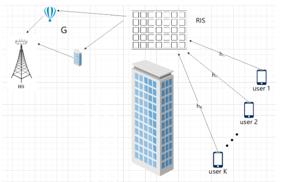

## Spatial Feature Aided Optimal Compressive Phase Training and Channel Estimation in Massive MIMO Systems with RIS

### 摘要

低导频开销的精确信道状态信息（CSI）获取一直是RIS辅助的大规模MIMO系统的一个问题。RIS的相移设计在信道估计（CE）中起着关键作用。在本文中，我们将RIS的空间特征融入到基于变分贝叶斯推理的CE算法的设计中，该算法计算效率高，可以利用级联信道的稀疏结构。为了优化配置CE的RIS相移，通过根据RIS阶段制定CE性能度量，提出了一种最佳阶段训练算法和简化版本。数值模拟表明，与现有技术的基线相比，所提出的空间特征辅助RIS的最优相位训练以及压缩CE算法以非常低的导频开销实现了优越的CE性能。

### 场景

$$ y_t=G\Phi_tHs_t+n_t $$

其中$G$为BS到RIS的信道，$H$为UE到RIS的信道。$\Phi^t$为t个时隙中RIS的相移矩阵。

进一步将信道建模为：

$$G=\sqrt{\frac{ML}{N_{br}}}\sum_{q=1}^{N_{br}}\rho_q\boldsymbol{\alpha}_M(\frac{2d}\lambda sin(\omega_{AOA}^q))\boldsymbol{\alpha}_L^H(\frac{2d}\lambda sin(\omega_{AOD}^q)),$$

$$h=\sqrt{\frac L{N_{ru}}}\sum_{r=1}^{N_{ru}}\rho_r\alpha_L(\frac{2d}\lambda sin(\phi_{AOA}^r)),$$

那么级联信道$H_C = GD_k$为：

$$\begin{array}{c}H_C=GD_k=\sum_{q=1}^{N_{br}}\sum_{r=1}^{N_{ru}}\sqrt{\frac{L^2M}{N_{br}N_{ru}}}\rho_q\rho_r\\\alpha_M(\frac{2d}\lambda\sin(\omega_{AOA}^q))\alpha_L^H(sin(\omega_{AOD}^q)-sin(\phi_{AOA}^r)).\end{array}$$

将$H_C$变换到角域有：$H_C=A_RXA_T^H,$，信道重新建模为：

$$\mathbf{Y}=A_R\mathbf{X}A_T^H\mathbf{\Phi}+N$$

### 先验支撑信息的获取

支撑信息定义为$\mathrm{PCSI}=\{\hat{\Omega},D,D_c\}$，其中D表示最大支撑数，$D_c$表示

