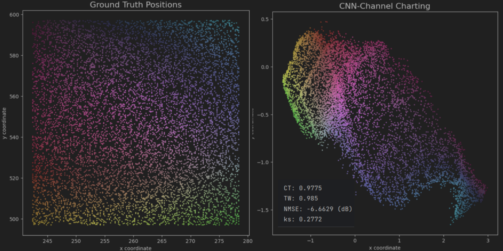

## Autoencoder

学习率：1e-5，epoch：200

csi维度(4018,4,16,8)，4基站，16天线，8载波，使用二阶矩作为特征，实部虚部堆叠输入网络网络，输入维度(4018,4,16,16,2)

**1、单基站Autoencoder训练结果**

**2、四基站Autoencoder训练结果**

**3、单基站Siamese网络训练结果**

**3、四基站Siamese网络训练结果**

