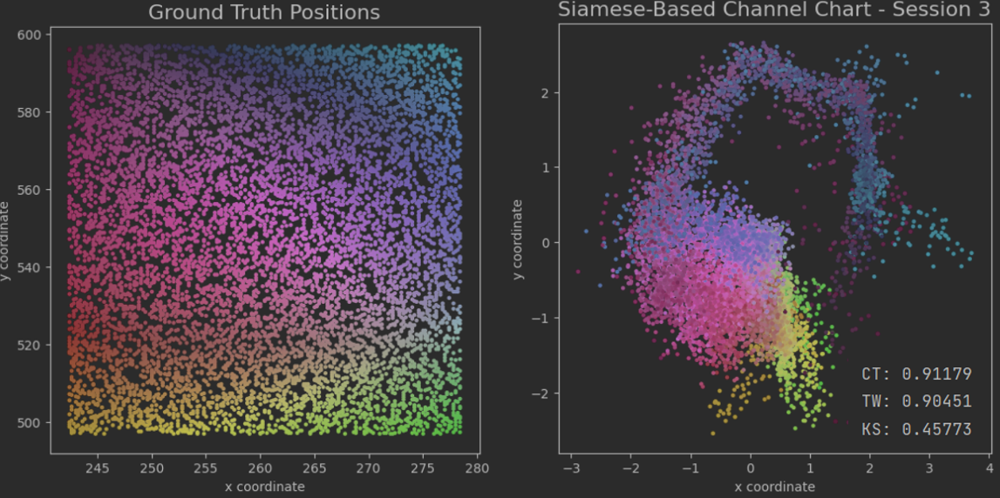

# 2024.1.17工作进展

## 1. Siamese网络

**仿真数据集场景**：

对$R1000-R1500$列网格的用户点进行采样，总计9018个用户采样点，单基站仿真使用的时3号基站采集到的数据，多基站仿真仿真使用的是3，4，5，6号基站，csi数据集维度为$(9018,4,16,8)$对应9018个用户，4个基站，16根天线，8个子载波。

根据“Angle-Delay Profile-Based and Timestamp-Aided Dissimilarity Metrics for Channel Charting”这篇文章尝试搭建了基于Siamese的多基站联合制图网络

**Siamese网络的架构**如下图所示，其中$d_{i,j}$是指i点和j点的相异性度量，$f^i,f^j$是指从i点j点csi中提取的特征，$z^i,z^j$是i点j点降维后的坐标，Siamese网络的目的就是尽量拟合使得降维后两点之间的距离$||z^i-z^j||_2$尽量接近两点csi的相异度$d_{i,j}$。

    

**相异度矩阵**：我选择的是csi的余弦相似度$d_{CS}$，下标b为基站，m为天线，n为子载波。

$$d_{\mathrm{CS},i,j}^b=\sum_{n=1}^{N_{\mathrm{sub}}}\left(1-\frac{\left|\sum_{m=1}^M\left(\mathbf{H}_{b,m,n}^{(i)}\right)^*\mathbf{H}_{b,m,n}^{(j)}\right|^2}{\left(\sum_{m=1}^M\left|\mathbf{H}_{b,m,n}^{(i)}\right|^2\right)\left(\sum_{m=1}^M\left|\mathbf{H}_{b,m,n}^{(j)}\right|^2\right)}\right)$$

**多基站相异度融合**:得到B个基站处的相异度矩阵$d_{\mathrm{CS}}^b$后，根据基站处接受SNR对多个基站的相异度矩阵加权相加：$\gamma_i^b$为i点在基站b处得到接收SNR，$w_b$表征基站b对样本i和j产生的相异性可靠性的权重。

$$D_{i,j}=\left(\sum_{b=1}^Bw_b\right)^{-1}\sum_{b=1}^Bw_bD_{i,j}^b,$$
$$w_b = [min(\gamma^b_i,\gamma^b_j)]^2$$
$$\gamma^b_i = \mathbb{E}\{\|\mathrm{h}_i^b\|_2^2/\sigma^2\}$$

得到融合的D后使用Dijkstra最短距离算法计算全局相异度矩阵，设置邻居数k=20。

**csi特征提取**：选用csi在天线维度上的自相关矩阵作为特征，并且实部虚部分离组成最后一个维度，也即特征提取后神经网络输入维度为(16,16,8,2)，之后展平为一维向量进入全连接层。

$$\mathbf{c}^{(l)}=\left(\tilde{\mathbf{H}}_{bm_1\tau}^{(l)}\left(\tilde{\mathbf{H}}_{bm_2\tau}^{(l)}\right)^*\right)_{(b,m_1,m_2,\tau)\in\mathcal{I}}$$

**csi特征的放缩**：“Channel Charting: Locating Users within the Radio Environment using Channel State Information”原文是假设路径损耗已知对csi特征进行放缩

$$\tilde{\mathbf{H}}=\frac{B^{\beta-1}}{\|\bar{\mathbf{H}}\|_F^\beta}\bar{\mathbf{H}}\quad with\quad\beta=1+1/(2\sigma),$$

**单基站网络训练结果**：

**多基站Siamese网络**：

$$\mathcal{L}_{\mathrm{Siamese}}=\sum_{i=1}^{N-1}\sum_{j=i+1}^{N}\left(d_{i,j}-\|\mathbf{z}_i-\mathbf{z}_j\|_2\right)^2 + \left(||\mathbf{W}_{fc2}||_F^2+||\mathbf{W}_{fc24}||_F^2+||\mathbf{W}_{fc64}||_F^2\right)$$

其中$\left(||\mathbf{W}_{fc2}||_F^2+||\mathbf{W}_{fc24}||_F^2+||\mathbf{W}_{fc64}||_F^2\right)$为fusion网络权重的$l2$正则项。

**(多基站相异度矩阵直接相加)网络训练效果**：

    

CT:$\in[0,1]$，越靠近1说明保留原始点集的连续性越好

TW:$\in[0,1]$，指示信道图有没有引入原始空间中并不存在的邻居点，越靠近1说明信道图越可信。

KS:$\in[0,1]$，指示信道图保留原始空间拓扑结构的程度，信道图的畸变与缩放旋转越多ks越大，ks越接近0说明拓扑结构保存的好。

**总结**：按照以上流程生成的多基站channel chart的ct,tw指标在$[0.90\pm 0.03]$左右，但是ks指标很高接近0.5说明全局的拓扑保存的还是不是很好。

**(多基站相异度矩阵加权融合)网络训练效果**：
正则惩罚项系数为12的结果：

正则惩罚项系数为17的结果：

正则惩罚项系数大于17时模型表现基本不再提升甚至有所下降。

## 2. 传统手工方法MDS(Multidimensional Scaling)

MDS以迭代的方式最小化$\min_{\{\mathbf{z}^{(l)}\}_{l=1}^L}\sum_{i=1}^{L-1}\sum_{j=i+1}^L\left(d_{i,j}-\|\mathbf{z}^{(i)}-\mathbf{z}^{(j)}\|_2\right)^2.$

使用和前面说明的Siamese网络相同的CS相异度矩阵和基于信噪比的多基站相异度融合，MDS的制图结果如下所示：

## 3. Autoencoder

Autoencoder我尝试了缩放sci和使用不同的feature：取实部虚部，取幅度或角度，最终网络训练出来的结果都不理想，效果最好的一次如下可见效果还不如手工方法MDS，应该是网络的构建和超参的选择上还有问题，后续计划一边调节网络一边思考后续的Usecase。

