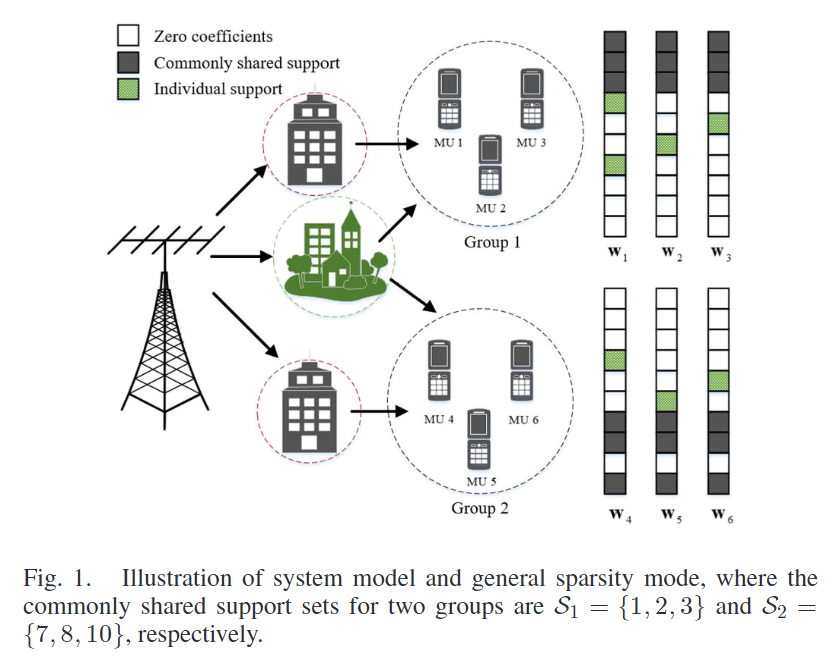

## 后续工作切入点

基于"Joint Channel Estimation and User Grouping for Massive MIMO Systems"

原文利用了多用户空间维度的互助信息，我们对其进行扩展利用其历史时刻的估计为当前时刻的估计提供先验信息，相当于引入了时间维度的互助，将原问题扩展到了时空维度。

相关文献："Spatial Feature Aided Optimal Compressive Phase Training and Channel Estimation in Massive MIMO Systems with RIS"

在时间维度上，尝试不止利用上一时刻的信息，而是多个历史时刻联合为当前提供历史信息例如使用AR模型。

相关文献：
"Massive MIMO Channel Prediction: Kalman Filtering vs. Machine Learning"

"Channel Prediction in High-Mobility Massive MIMO: From Spatio-Temporal Autoregression to Deep Learning"

## 进一步思路

以上只是一个切入点，总体来说创新度还是比较低。老师建议可以多从场景问题方面去创新，比如结合移动性场景。另外，可以想想能不能**拓展到ELAA（超大规模天线阵列）的分布式信道估计**。

大概背景是ELAA是由若干个小的阵面拼接而成，各自背后有一个处理单元，所以有**分布式信道估计**的需求。另一个跟ELAA相关的特性是**空间的非稳态性**（spatial non-stationary），即每个小的阵面可能看到的scattering环境相关性很高但又不尽相同，那么这一点跟多用户互助有相似之处。最终能否把分布式信道估计，阵面互助以及用户互助整个放在变分贝叶斯的算法框架下。

**什么是ELAA?**

最近先根据，之前讨论的那个切入点，把历史信息提供的支撑先验信息放进那套变分贝斯信道估计的概率模型里面里面，从空间互助做成时空互助，然后再去想怎么扩展到ELAA里面，我了解了一下ELAA的特性，和之前讨论的工作不同的是，天线的见域，散射体的集群，还有多用户也可能共享一组散射体，所以信道模型，信道响应的稀疏性都需要重新去建模，所以后续可能还要继续调研一下。

## 概率模型

$$
    \begin{aligned}
        \mathbf{y}_k=\Phi(\mathbf{w}_k^s+\mathbf{w}_k^v)+\mathbf{n}_k=\bar{\Phi}\bar{\mathbf{w}}_k+\mathbf{n}_k, \\\\
        p(\mathbf{y}_{k}|\mathbf{w}_{k}^{s},\mathbf{w}_{k}^{v},\alpha)=\mathcal{CN}(\mathbf{y}_{k}|\mathbf{\Phi}\mathbf{w}_{k},\alpha^{-1}\mathbf{I}),\\\\
        p(\mathbf{w}_k^s|\gamma_g^*)=\mathcal{CN}(\mathbf{w}_k^s|\mathbf{0},\mathrm{diag}\left(\gamma_g^*\right)^{-1}),\forall k\in\mathcal{G}_g \\\\
        p(\mathbf{w}_k^v|\gamma_k^v)=\mathcal{CN}(\mathbf{w}_k^v|\mathbf{0},\rho\cdot\mathrm{diag}(\gamma_k^v)^{-1}), \\\\
        p(\mathbf{w}_k^s|\mathbf{z}_k,\Gamma^*)=\prod_{g=1}^G\left\{\mathcal{CN}(\mathbf{w}_k^s|\mathbf{0},\operatorname{diag}(\gamma_g^*)^{-1}\right\}^{z_{k,g}},\\
        p(\gamma_g^*)=\prod_{l=1}^{\hat{L}}\Gamma(\gamma_{g,l}^*|a,b) , \\
        p(\gamma_k^v)=\prod_{l=1}^{\hat{L}}\Gamma(\gamma_{k,l}^v|a,b),
    \end{aligned}
$$

先验支撑信息定义{$\hat{\Omega},D_c,D$}，其中$\hat{\Omega} \in \mathbb{R}^{\hat{L}\times 1}$为当前时刻的先验支撑信息的估计。它来自前$\tau$个时刻的历史估计信息$\{\hat{\Omega}(-\tau),\hat{\Omega}(-\tau+1),...,\hat{\Omega}(-1)\}$，而$D$为先验支撑的上界$D=max_{t\in\{2,..,\tau\}}|\hat{\Omega}(-t)|$，$D_c$为支撑先验的下界$D_c=min_{t\in\{2,\cdots,\tau\}}|\hat{\Omega}(-t)\cap \hat{\Omega}(-t+1)|$，这里支撑下界的选取是由于如果选取当前时刻的上一个时刻作为支撑先验即$\hat{\Omega}(-1)$，那么下界的选取就只能从过去两个相邻时刻的最小交集里选取。

先使用先验支撑信息构造概率模型，其中$w^s_k$指示了用户之间的共享稀疏性，将用户分为了G组，如果用户k属于g组那么就对应一组$\gamma^*_g$,而这种共享的稀疏性大概率变化较为缓慢，即与历史信息相关，我们使用$\hat{\Omega}^g_k \in \mathbb{R}^{G\times 1}$作为第k个用户当前时刻所属组别的估计。使用$\hat{\Omega}^v_k$作为k用户在当前时刻个体稀疏性的先验支撑估计。

- 增加隐变量$d^v_{k,l}$用于指示$w^v_k$的第$l$个元素是否在先验支撑中，那么有：

$$
    \begin{aligned}
        p(d^v_{k,l}) = \pi_m^{d^v_{k,l}}(1-\pi_m)^{(1-d^v_{k,l})} \\
        p(d^v_k) = \prod^{\hat{L}}_{l=1}  \pi_m^{d^v_{k,l}}(1-\pi_m)^{(1-d^v_{k,l})}\\
    \end{aligned}
$$

$$
    \left\{
             \begin{array}{lr}
             \pi_m = \xi_1 = \frac{D_c}{D}, if\ (k,l) \in \hat{\Omega}^v_k \\
             \pi_m = \xi_2 = \frac{D-D_c}{\hat{L}-|\hat{\Omega}^v_k|}, if\ (k,l) \notin \hat{\Omega}^v_k,  
             \end{array}
\right.
$$

这里相当于$P(d^v_{k,l}=1| (k,l) \in \hat{\Omega}^v_k) = \frac{D_c}{D}$，$P(d^v_{k,l}=1| (k,l) \in \hat{\Omega}^v_k) = \frac{D-D_c}{\hat{L}-|\hat{\Omega}^v_k|}$，相应的$\gamma^v_k$的概率分布重建为

$$
    p(\gamma^v_k|d^v_k) = \prod^{\hat{L}}_{l=1}\Gamma(\gamma^v_{k,l} | a,b)^{d^v_{k,l}} \Gamma(\gamma^v_{k,l} | \overline{a},\overline{b})^{(1-d^v_{k,l})}
$$

$$
    p(w^v_k , \gamma^v_k, d^v_k) = p(w^v_k | \gamma^v_k)p(\gamma^v_k|d^v_k)p(d^v_k)
$$

>论文"Channel Prediction in High-Mobility Massive MIMO: From Spatio-Temporal Autoregression to Deep Learning"提供了一个如何去决定支撑信息大小的方法就是使用功率作为约束，$\lambda$为设置的(0,1)阈值，事实证明，将λ设置为接近1仍然会产生较小的Ns。

$$\begin{aligned}\Omega_s&=\underset{\Omega_s}{\operatorname*{arg}}\min_{\Omega_s}\left|\Omega_s\right|\\&\text{s.t.}\sum_{(i_s,j_s)\in\Omega_s}E\left\{\left|\left[\mathrm{H}_k\left(t\right)\right]_{i_s,j_s}\right|^2\right\}\\&\geqslant\lambda\sum_{i=0}^{N_a-1}\sum_{j=0}^{N_g-1}E\left\{\left|\left[\mathrm{H}_k\left(t\right)\right]_{i,j}\right|^2\right\},\end{aligned}$$

此外，当获取的信道被噪声污染时，可以根据信噪比自适应地设置比值λ。我们将带有噪声的估计信道表示为

$$\begin{aligned}\text{SNR}=10\log\left(\frac{\sum_{i=0}^{N_a-1}\sum_{j=0}^{N_c-1}E\left\{\left|\left[\mathbf{G}_k\left(t\right)\right]_{i,j}\right|^2\right\}}{N_aN_c\sigma_z^2}\right)\end{aligned}$$

对于SNR以dB为单位的噪声ADCRM，可以将λ的适当百分比值近似设置为

$$\lambda\approx\frac{N_c\cdot10^{\frac{\mathrm{SNR}}{10}}}{N_g+N_c\cdot10^{\frac{\mathrm{SNR}}{10}}}.$$

## 2023年11月23日组会

1. 先解决多基站multipoint 生成Channel Charting(尽可能地保留真实物理空间  的拓扑结构)，考虑生成CC的feature，尝试用信道的spasity patten作为feature。
2. 考虑使用卡尔曼滤波或是autoencoder的方法来预测用户的轨迹z，MU情况下每个用户对应一个轨迹z每个z有自己的历史轨迹。
3. 得到了用户轨迹的预测后，两种用途，一是作为信道迭代估计方法的初值，减少迭代次数，二是直接使用网络根据轨迹预测输出precoding
4. 由于Multipoint CC压缩了多个基站的信息所以可以做joint precoding
5. 信道模型方面关注DeepMIMO