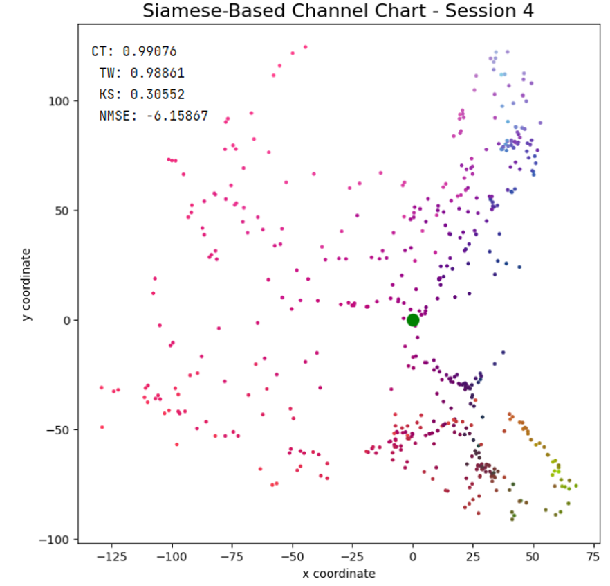
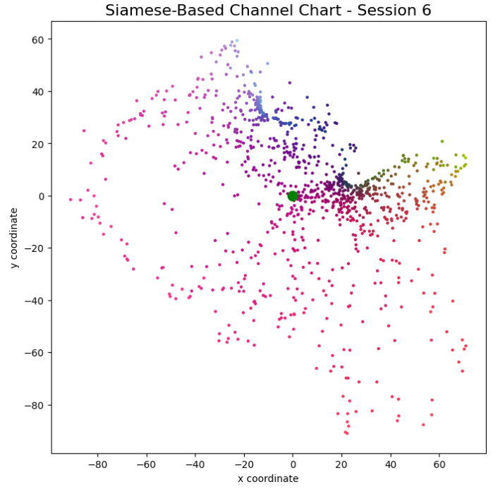
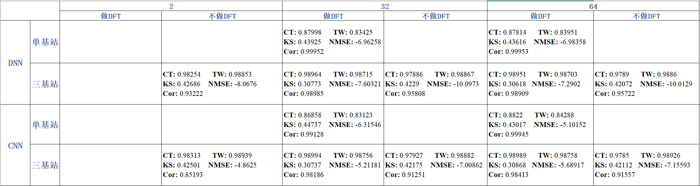
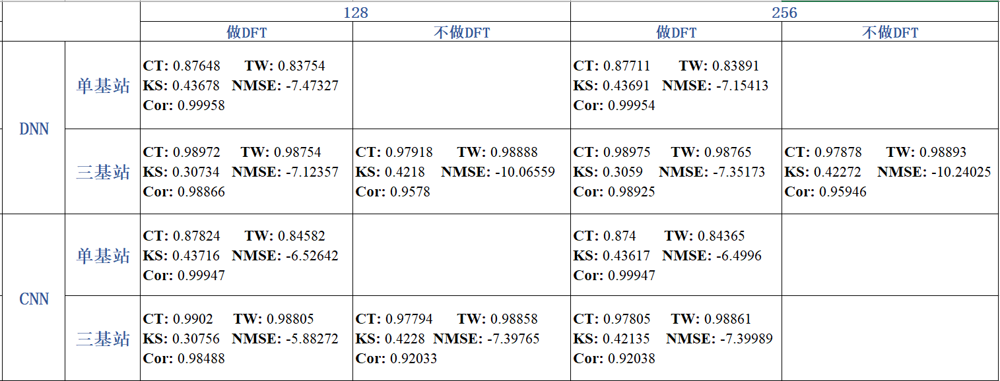
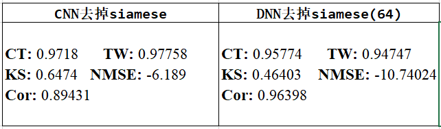

## 情况1

1. csi重新排布csi(1000,3,4,2,8,4,408)只用户的第一根天线csi(1000,3,2,8,4,408)
2. 做DFT转换角度时延域csi(1000,3,2,8,4,408)
3. 取前32个时延抽头
4. 对csi做scaling
5. 使用角度时延域矩阵计算ADP相异性矩阵
6. 每个极化方向上做协方差csi(1000,3,2,32,32),将极化维度平均csi(1000,3,32,32)
7. 实虚部分离输入网络csi(1000,3,32,32,2)

问题：CT，TW指标在0.93左右，但是重构误差非常大NMSE有40多dB。

## 情况2

1. csi重新排布csi(1000,3,4,2,32,408)只取用户的第一根天线csi(1000,3,2,32,408)
2. 每个激化方向求协方差然后计划维度求平均csi(1000,3,32,32)，最后两个维度做二维DFT
3. 对csi做scaling
4. 使用已经求了协方差的csi矩阵计算ADP相异性矩阵
5. 实虚部分离输入网络csi(1000,3,32,32,2)

**DNN 单机站 hiden_dim=64**

>CT: 0.88169 
TW: 0.84884 
KS: 0.42865 
NMSE: -7.18402
cosine_similarity: 0.87744

** DNN 三基站 hiden_dim=64**

CT: 0.99076 
 TW: 0.98861 
 KS: 0.30552 
 NMSE: -6.15867
 cosine_similarity: 0.80278

** DNN 三基站 hiden_dim=128**

**CNN 三基站 hiden_dim=64**

CT: 0.98972 
 TW: 0.98688 
 KS: 0.3087 
 NMSE: -5.00652
cosine_similarity: 0.82322

**CNN 三基站 hiden_dim=128**
CT: 0.98991 
 TW: 0.98769 
 KS: 0.30614 
 NMSE: -5.70405 
 cosine_similarity: 0.85523

 ## 情况三

1. csi重新排布csi(1000,3,4,2,32,408)只取用户的第一根天线csi(1000,3,2,32,408)
2. 每个激化方向求协方差然后计划维度求平均csi(1000,3,32,32)，最后两个维度做二维DFT
3. 对csi做scaling
4. 使用已经求了协方差的csi矩阵计算ADP相异性矩阵
5. 实虚部分离csi(1000,3,32,32,2)
6. 将csi进行归一化再输入网络

**DNN 单基站 hiden_dim=2**
CT: 0.8566 
 TW: 0.78874 
 KS: 0.47981 
 NMSE: -4.49805 
 cosine_similarity: 0.99916

**DNN 三基站 hiden_dim=2**

 CT: 0.98423 
 TW: 0.98091 
 KS: 0.26063 
 NMSE: -5.1962 
 cosine_similarity: 0.98229

**DNN 单基站 hiden_dim=32**
CT: 0.87998 TW: 0.83425 
KS: 0.43925 
NMSE: -6.96258 
cosine_similarity: 0.99952

**DNN 三基站 hiden_dim=32**
 CT: 0.98964 
 TW: 0.98715 
 KS: 0.30773 
 NMSE: -7.60321 
 cosine_similarity: 0.98985

**DNN 单基站 hiden_dim=64**

CT: 0.87814 
 TW: 0.83951 
 KS: 0.43616 
 NMSE: -6.98358 
 cosine_similarity: 0.99953

**DNN 三基站 hiden_dim=64**
CT: 0.98951 
 TW: 0.98703 
 KS: 0.30618 
 NMSE: -7.2902 
 cosine_similarity: 0.98909

**DNN 单基站 hiden_dim=128**
 
 CT: 0.87648 
 TW: 0.83754 
 KS: 0.43678 
 NMSE: -7.47327 
 cosine_similarity: 0.99958

**DNN 三基站 hiden_dim=128**

 CT: 0.98972 
 TW: 0.98754 
 KS: 0.30734 
 NMSE: -7.12357 
 cosine_similarity: 0.98866

**DNN 单基站 hiden_dim=256**
 CT: 0.87711 
 TW: 0.83891 
 KS: 0.43691 
 NMSE: -7.15413 
 cosine_similarity: 0.99954

**DNN 三基站 hiden_dim=256**
 CT: 0.98975 
 TW: 0.98765 
 KS: 0.3059 
 NMSE: -7.35173 
 cosine_similarity: 0.98925

---
**CNN 单基站 hiden_dim=2**
CT: 0.82255 
 TW: 0.75761 
 KS: 0.64026 
 NMSE: -0.8536 
 cosine_similarity: 0.99809

**CNN 三基站 hiden_dim=2**
CT: 0.93387 
 TW: 0.95718 
 KS: 0.57117 
 NMSE: -3.8813 
 cosine_similarity: 0.97579

**CNN 单基站 hiden_dim=32**
CT: 0.86858
 TW: 0.83123 
 KS: 0.44737 
 NMSE: -6.31456 
 cosine_similarity: 0.99128

**CNN 三基站 hiden_dim=32**
CT: 0.98994 
 TW: 0.98756 
 KS: 0.30737 
 NMSE: -5.21181 
 cosine_similarity: 0.98186

**CNN 单基站 hiden_dim=64**

 CT: 0.8822 
 TW: 0.84288 
 KS: 0.43017 
 NMSE: -5.10152 
 cosine_similarity: 0.99945

**CNN 三基站 hiden_dim=64**

CT: 0.98989 
 TW: 0.98758 
 KS: 0.30868 
 NMSE: -5.68917 
 cosine_similarity: 0.98413

去掉siamese网络只保留autoencoder的效果：
CT: 0.94255 
 TW: 0.95831 
 KS: 0.57912 
 NMSE: -2.18133 
 cosine_similarity: 0.96469 

**CNN 三基站 hiden_dim=128**
 CT: 0.9902 
 TW: 0.98805 
 KS: 0.30756 
 NMSE: -5.88272 
 cosine_similarity: 0.98488

**CNN 单基站 hiden_dim=128**

 CT: 0.87824 
 TW: 0.84582 
 KS: 0.43716 
 NMSE: -6.52642 
 cosine_similarity: 0.99947

 **CNN 三基站 hiden_dim=256**

CT: 0.98991 
 TW: 0.98802 
 KS: 0.30472 
 NMSE: -5.91735 
 cosine_similarity: 0.98501

  **CNN 单基站 hiden_dim=256**

 CT: 0.874 
 TW: 0.84365 
 KS: 0.43617 
 NMSE: -6.49996 
 cosine_similarity: 0.99947

## 不做DFT

**DNN 单基站 hiden_dim=2**
CT: 0.86589 
 TW: 0.83813 
 KS: 0.49612 
 NMSE: -6.71584 
 cosine_similarity: 0.96505

**DNN 三基站 hiden_dim=2**

CT: 0.98254 
 TW: 0.98853 
 KS: 0.42686 
 NMSE: -8.0676 
 cosine_similarity: 0.93222

**DNN 三基站 hiden_dim=16**
CT: 0.9792 
 TW: 0.98867 
 KS: 0.4209 
 NMSE: -10.04635 
 cosine_similarity: 0.95757

**DNN 单基站 hiden_dim=32**
CT: 0.87265 
 TW: 0.86955 
 KS: 0.47876 
 NMSE: -10.20262 
 cosine_similarity: 0.9845

**DNN 三基站 hiden_dim=32**
CT: 0.97886 
 TW: 0.9886 
 KS: 0.42299 
 NMSE: -10.09721 
 cosine_similarity: 0.95808

**DNN 单基站 hiden_dim=64**
CT: 0.87317 
 TW: 0.87546 
 KS: 0.47767 
 NMSE: -10.29771 
 cosine_similarity: 0.98483

**DNN 三基站 hiden_dim=64**
 CT: 0.9789 
 TW: 0.9886 
 KS: 0.42072 
 NMSE: -10.01295 
 cosine_similarity: 0.95722

 **去掉Siamese**
CT: 0.95774 
 TW: 0.94747 
 KS: 0.46403 
 NMSE: -10.74024 
 cosine_similarity: 0.96398

**DNN 单基站 hiden_dim=128**
CT: 0.87278 
 TW: 0.87234 
 KS: 0.47861 
 NMSE: -10.30605 
 cosine_similarity: 0.98486

**DNN 三基站 hiden_dim=128**
CT: 0.97918 
 TW: 0.98888 
 KS: 0.4218 
 NMSE: -10.06559 
 cosine_similarity: 0.9578

**DNN 单基站 hiden_dim=256**
 CT: 0.8721 
 TW: 0.87159 
 KS: 0.47553 
 NMSE: -10.36651 
 cosine_similarity: 0.98507

**DNN 三基站 hiden_dim=256**
 CT: 0.97878 
 TW: 0.98893 
 KS: 0.42272 
 NMSE: -10.24025 
 cosine_similarity: 0.95946

**CNN 单基站 hiden_dim=2**
CT: 0.86925 
 TW: 0.82589 
 KS: 0.55851 
 NMSE: -5.99871 
 cosine_similarity: 0.95864

**CNN 三基站 hiden_dim=2**
CT: 0.98313 
 TW: 0.98939 
 KS: 0.42501 
 NMSE: -4.86285 
 cosine_similarity: 0.85193
 

**CNN 单基站 hiden_dim=32**
 CT: 0.91369 
 TW: 0.8331 
 KS: 0.45173 
 NMSE: -8.8141 
 cosine_similarity: 0.97859

**CNN 三基站 hiden_dim=32**
 CT: 0.97927 
 TW: 0.98882 
 KS: 0.42175 
 NMSE: -7.00862 
 cosine_similarity: 0.91251

**CNN 单基站 hiden_dim=64**
 CT: 0.90995 
 TW: 0.82554 
 KS: 0.59173 
 NMSE: -8.06973 
 cosine_similarity: 0.97457

**CNN 三基站 hiden_dim=64**
 CT: 0.9785 
 TW: 0.98926 
 KS: 0.42122 
 NMSE: -7.15593 
 cosine_similarity: 0.91557

**去掉了siamese**
 CT: 0.9718 
 TW: 0.97758 
 KS: 0.64744 
 NMSE: -6.18919 
 cosine_similarity: 0.89431

**CNN 单基站 hiden_dim=128**
 CT: 0.91702 
 TW: 0.83119 
 KS: 0.44641 
 NMSE: -8.89353 
 cosine_similarity: 0.97898

**CNN 三基站 hiden_dim=128**
CT: 0.97794 
 TW: 0.98858 
 KS: 0.4228 
 NMSE: -7.39765 
 cosine_similarity: 0.92033

**CNN 单基站 hiden_dim=256**
 CT: 0.8957 
 TW: 0.82907 
 KS: 0.43012 
 NMSE: -8.88785 
 cosine_similarity: 0.97895

**CNN 三基站 hiden_dim=256**
CT: 0.97805 
 TW: 0.98861 
 KS: 0.42135 
 NMSE: -7.39989 
 cosine_similarity: 0.92038

## 统计

